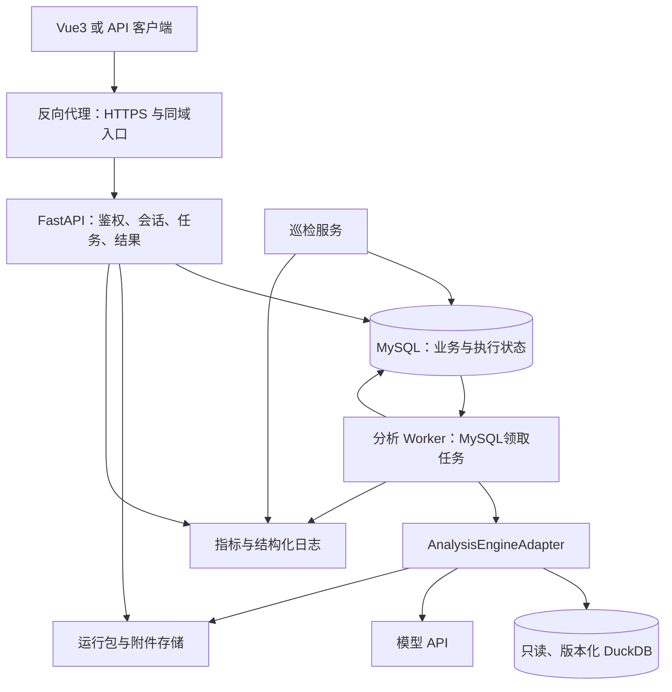
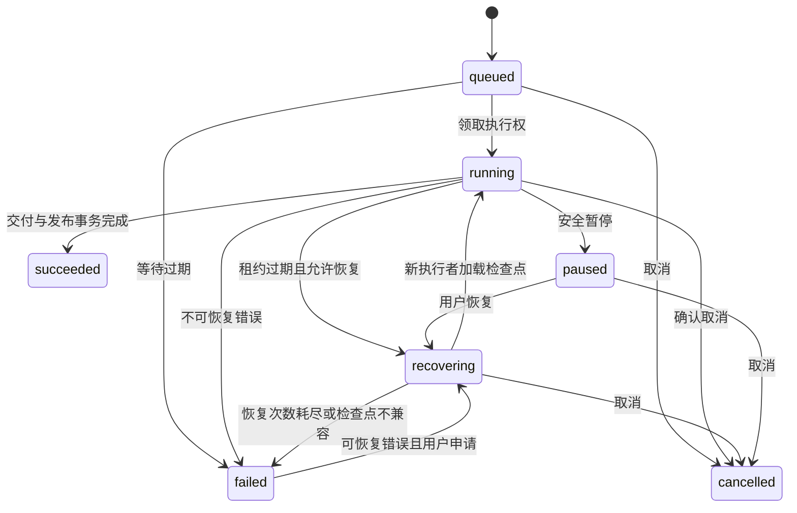

# FinSights 后端服务 PRD：基础设计、断点续跑与线上监控

日期：2026-10-09。状态：待实现、待验收。目标产品：面向领导班子的复杂财务分析 Agent。

本文是交给开发 Agent 的实现合同。已有分析引擎与本次新增的服务能力必须分别交付；写入文档的指标、恢复能力和高可用方案均不代表已经验证。面试讲解见[后端设计面试文档](../面试文档/05_后端服务与断点续跑设计.md)。

## 1. 目标、范围与交付原则

将命令行分析程序包装成可部署的内部试用服务：用户登录后提交问题，服务异步执行，用户可以查看历史、进度、答案和证据；执行进程中断后可以恢复已提交的分析状态；管理员可以发现并定位失败、拥塞、成本和质量问题。

| 优先级 | 本轮要求 |
|---|---|
| P0，必须完成 | FastAPI、MySQL、独立任务 Worker、登录与对象权限、会话与上下文快照、异步运行与取消、提交幂等、MySQL 任务队列与租约、跨进程模型限流、节点级断点续跑、MySQL 调用流水与管理员查询页、部署与故障验收 |
| P1，P0 验收后 | 节点内部按工具调用接续、SSE 实时事件、企业 SSO、对象存储与完整链路追踪、数据库备份恢复演练 |
| 后续扩展 | Redis/Celery 替代 MySQL 任务队列或承担共享限流（由压测触发）、多机器高可用部署、更高并发、分析内部并发、Skill 检索、独立分析数仓 |

Vue3 是前端目标技术。本次后端必须给出 OpenAPI、事件和错误协议及接入示例；完整 Vue3 页面不属于本 PRD 的后端验收。可用 API 客户端演示整个流程，前端随后按协议接入。

保持现有 single/multi 模式和 CLI 可用。业务问题的分析方法、七题 Skill 开发和旧分析策略调整不在本次收尾范围。仅修复阻碍服务隔离、恢复、引用正确性和结果发布的必要问题。

## 2. 当前基础与接入约束

- `agent/cli.py`：现有运行入口与运行包导出；财务数据位于 `data/finsights.duckdb`。
- `agent/loop.py`：RunContext、结果库、账本、消息、压缩状态与统计。
- `agent/multi.py`：同步主循环，创建 AnalysisState、主 Agent 消息并调度子角色。
- `agent/analysis_state.py`：任务图、产物、审查与 continuation；存在文件持久化，不等于完整进程恢复。
- `agent/subagents.py`：支持载入历史消息，但当前恢复分支没有追加新 user_content，历史中的“停止调用工具”指令可能继续生效。必须修复并验收。
- 现有运行包能审查答案和轨迹，但缺少服务级任务执行权、主循环完整恢复、可靠投递与跨进程限流。不能直接把 CLI 放入 HTTP 请求里执行后宣称上线完成。

开发前读取最新代码，保留其他 Agent 的未提交修改。不要读取或输出 `.env` 中的密钥。此前调度 PRD 是分析引擎的参考，本 PRD 定义服务边界；不要求先完成分析内部并发。

## 第一部分：基础设计

## 3. 部署结构与模块边界



技术建议：FastAPI + Pydantic；SQLAlchemy 2 + Alembic；MySQL 8 的 InnoDB；独立 Python Worker 进程。P0 不依赖 Redis、Celery、Docker 或自建 Prometheus/Grafana。锁定实际依赖版本并记录，按联想批准的运行环境安装 API 和 Worker。

API 与 Worker 独立部署。MySQL 同时保存任务状态和待执行队列；Worker 从 `analysis_runs` 领取任务。无需另建 Redis 队列或事务发件箱，也没有另一份需要协调的队列状态。财务库本轮保留 DuckDB，各进程建立自己的只读连接，禁止多个 Worker 更新同一数据库文件。ETL 发布不可变的新数据文件，运行按版本固定路径，保留恢复所需旧版本。

建议目录：

```text
backend/
  api/                  # HTTP、鉴权依赖、请求与响应
  services/             # 会话、运行、取消、恢复、上下文
  persistence/          # 模型、仓储、事务与迁移
  workers/              # MySQL 任务领取、任务执行与巡检
  engine/               # 现有分析代码适配、检查点序列化
  observability/        # 调用流水、健康检查、可选指标导出
deploy/                 # 部署说明与公司监控平台接入配置
```

API 不导入并启动分析循环。数据库事务不跨越模型调用，也不在网络等待期间持有行锁。异步路由中使用异步数据库驱动；同步分析代码只在 Worker 执行。

### 3.1 分析引擎接口

定义 `start(run_spec, checkpoint_sink, event_sink, control)` 与 `resume(run_spec, checkpoint, checkpoint_sink, event_sink, control)`。参数含 run_id、attempt_id、执行版本号、冻结的上下文、数据与执行配置版本。`control` 查询取消/暂停请求和执行权，不依赖进程内全局变量。

复用现有初始化与导出逻辑，提取共享服务函数，避免 CLI 和后端各维护一套业务流程。每次运行独立创建 RunContext、模型客户端、消息、结果库、账本和 trace。共享限流可跨任务使用，客户端中可变的 nudged、last_call_events 等状态不能跨运行共享。

运行输出位于服务生成的 `run_id/attempt_id` 路径。客户端不能指定文件路径、模型密钥、工具白名单或任意 SQL。工具保留现有权限限制，不允许模型调用业务 MySQL 的写入接口。

## 4. 身份、会话与上下文

### 4.1 鉴权与数据访问

P0 使用管理员预创建的内部账户，角色为 user/admin。密码保存 Argon2id 哈希，不保存明文。登录成功签发随机不透明会话令牌，MySQL 保存令牌哈希、用户、过期和撤销时间；浏览器通过 HttpOnly、Secure、SameSite Cookie 携带。生产同域入口；修改请求校验 CSRF Token 和 Origin。退出撤销会话。登录失败限流，不在错误中透露账户是否存在。

所有会话、任务、事件、证据、下载、取消和恢复接口执行对象归属校验。访问他人对象返回统一 404，管理员读取和恢复操作记录审计。运行权限与业务数据范围由服务确定，不能让模型自行授权。初期公开财报可共用数据源，用户会话与运行产物仍隔离；后续企业数据另加组织与数据集权限。

### 4.2 上下文的保存与使用

完整 messages 保存给用户回看；context_snapshot 是本次实际送入模型的输入，二者分别保存。快照含当前问题、确认的公司/期间/单位、按 Token 预算选择的历史、可选历史摘要、显式引用的证据和构造版本。

P0 实现确定性的历史选择：优先当前问题和确认条件，再加入最近相关消息；超预算时记录省略范围并提示用户。摘要是 P1；不能在没有摘要程序时宣称完成长期记忆。历史数字进入新分析前加载其真实证据或重新查询，不把回答文本当取数结果。其他运行的证据导入当前结果库后分配当前 rid，同时记录原 `(run_id, rid)` 和数据版本。

快照在提交时冻结并保存，后续会话变化不修改正在执行的输入。每个会话最多一个活动任务；活动定义为 queued/running/recovering/paused。新分析冲突返回 409，引导用户等待、取消或新建会话。全局仍可执行不同会话的任务。conversation 的 active_run_id 通过行锁和条件更新维护，不能只查内存。

## 5. 数据模型与索引

ID 使用服务生成的 UUID；时间统一 UTC，API 使用带时区的 ISO 8601，前端按用户时区展示。运行状态通过条件更新控制，不能由客户端任意修改。

| 表 | 关键字段与约束 |
|---|---|
| users | id、username 唯一、password_hash、role、disabled |
| auth_sessions | token_hash 唯一、user_id、expires_at、revoked_at |
| conversations | id、user_id、title、context_version、active_run_id、timestamps |
| messages | id、conversation_id、seq、role、content、run_id、final_run_id；唯一(conversation_id, seq)，final_run_id 可空且唯一，仅最终 assistant 消息填写run_id，保证一次运行只发布一条最终消息 |
| context_snapshots | id、conversation_id、context_version、payload、hash、builder_version；保存实际输入，无密钥 |
| analysis_runs | id、user_id、conversation_id、snapshot_id、status、answer_status、verified、execution_epoch、active_attempt_id、latest_checkpoint_id、lease_expires_at、heartbeat_at、claimed_at、next_attempt_at、dispatch_generation、cancel_requested、pause_requested、resume_allowed、error_code、usage、版本、timestamps |
| run_attempts | id、run_id、attempt_no、execution_epoch、worker_id、status、恢复检查点、started/ended_at、error_code；唯一(run_id, attempt_no) |
| submission_keys | user_id、key、request_hash、run_id；唯一(user_id, key)，相同 key 不同请求返回 409 |
| model_rate_limits | provider_alias、window_started_at、requests_in_window、rpm_limit、updated_at；按供应商/服务端 Key 别名一行，原子计数 |
| model_call_leases | id、provider_alias、run_id、attempt_id、expires_at、heartbeat_at；用于跨 Worker 并发许可，异常退出后可回收 |
| run_events | run_id、seq、attempt_id、type、safe_payload、created_at；唯一(run_id, seq)，索引(run_id, seq) |
| run_checkpoints | id、run_id、seq、attempt_id、execution_epoch、schema_version、payload、hash、data/config/prompt/skill/engine_version、created_at；唯一(run_id, seq) |
| tool_results | run_id、rid、tool、args、typed_result、unit、data_version、digest、operation_id；唯一(run_id, rid)，唯一(run_id, operation_id) |
| run_artifacts | run_id、artifact_id、revision、type、hash、metadata、storage_uri；按对象版本唯一，不覆盖历史版本 |
| run_call_logs | id、run_id、attempt_id、call_seq、role、node_id、call_kind、call_name、status、duration_ms、model_alias、usage、args_json、filters_json、query_text、row_count、result_rid、error、result_preview、ts；唯一(run_id, attempt_id, call_seq)，索引(run_id, id) |
| audit_events | 操作者、对象、操作、结果、时间；不含密码、令牌和原始敏感输入 |

analysis_runs 索引：(status, next_attempt_at, created_at)、(status, lease_expires_at)、(user_id, created_at)、(conversation_id, created_at)。model_call_leases 索引：(provider_alias, expires_at)。列表采用游标分页，默认 20、上限 100。

MySQL 队列领取须用很短的 InnoDB 事务：按 `next_attempt_at, created_at` 选出少量 queued/recovering 任务，使用 `FOR UPDATE SKIP LOCKED` 锁定并更新为 running、增加 execution_epoch、写 attempt 和租约，然后立即提交。只在锁行后做状态更新，模型调用与文件操作都在事务外。MySQL 官方说明 `SKIP LOCKED` 可用于减少队列表竞争，但返回的是不一致视图，因此只用于领取工作，不用于普通业务读取。[MySQL 锁定读说明](https://dev.mysql.com/doc/refman/8.0/en/innodb-locking-reads.html)

P0 将恢复所需的结构化检查点和工具结果保存在 MySQL：payload 使用版本化 JSON；DataFrame 需要保存字段类型、精度、日期/null 等可恢复信息，不能只存 digest 或被截断的导出。分块保存大型结果并配置大小上限，超限返回明确错误。完整日志和下载运行包保存到共享挂载卷，MySQL 保存索引。P1 转对象存储时采用不可变对象 + 校验哈希 + 事务内指针；上传未提交对象可后续回收。

## 6. REST API 合同与前端事件

统一前缀 `/api/v1`，自动生成 OpenAPI。所有创建/恢复请求校验幂等编号。请求错误统一 `{code, message, request_id, details}`，不把数据库错误或密钥返回用户。

| 方法与路径 | 行为 |
|---|---|
| POST /auth/login；POST /auth/logout；GET /auth/me | 登录、退出、当前用户 |
| POST /conversations；GET /conversations | 创建和分页查询自己的会话 |
| GET /conversations/{id}/messages | 按 seq 分页读取历史 |
| POST /conversations/{id}/runs | 带 Idempotency-Key；保存问题、快照和 queued 任务，返回 202 |
| GET /runs/{id} | 状态、当前阶段、答案、核验、累计用量、是否可恢复 |
| GET /runs/{id}/events?after_seq=0&limit=100 | 读取可展示事件；返回 next_seq，无新事件也返回成功 |
| GET /runs/{id}/artifacts/{artifact_id} | 读取有权限的产物与证据 |
| GET /runs/{id}/results/{rid} | 分页取证据；按 run_id 隔离 |
| POST /runs/{id}/pause | 请求在安全边界暂停；返回 202 |
| POST /runs/{id}/cancel | 请求取消；重复请求返回当前状态 |
| POST /runs/{id}/resume | 带 Idempotency-Key；恢复同一 run_id，返回 202 和恢复申请编号 |
| GET /admin/runs；GET /admin/runs/{id}/attempts | 管理员排查、重试/恢复记录；访问留审计 |
| GET /admin/runs/{id}/calls?after_id=0&limit=100 | 按游标查看一次运行的模型/工具调用流水；管理员权限，查询操作留审计 |
| GET /health/live；GET /health/ready | 存活与就绪；内部检查依赖 |
| GET /metrics | 若联想批准的采集平台使用 Prometheus 格式，则开放给内网采集器；不要求自建 Prometheus |

提交示例：`{"question":"联想 FY2027Q1 存货增长是否说明周转恶化？","as_of":null,"mode":"multi_agent"}`。返回：`{"run_id":"…","status":"queued","events_url":"…","request_id":"…"}`。模型和执行配置由服务配置确定，用户不任意覆盖。

GET run 响应区分：status（程序执行状态）、answer_status（answered/clarify/refuse，沿用引擎口径）、verified（数字核验）、review_status（语义审查）、human_review_status（人工检查，默认 pending）。succeeded 表示形成合法终态交付；合法 clarify/refuse 可成功结束执行，但不计入有效回答成功率。核验或必须修正意见未满足时，不能把答案标为已验证成功；保存候选供管理员排查。

事件含 `seq、type、stage、timestamp、attempt_id、payload`。P0 包含 queued、started、stage_changed、node_completed、checkpoint_saved、paused、recovering、cancelled、failed、answer_published。只展示业务阶段、可核查工作与证据；不把原始模型聊天或内部日志直接推给用户，不宣称展示模型内部思维。没有可靠进度分母时不用虚构百分比。P0 前端 2 秒轮询，页面隐藏后降频。P1 SSE 按 Last-Event-ID 补读 MySQL 事件；消息推送只作提醒，断线不影响执行与持久化。

HTTP：401 未登录、404 无权/对象不存在、409 状态或版本冲突、422 输入不合法、429 用户额度/队列容量不足、503 必需基础设施不可用；429/503 可附 Retry-After。模型供应商的限流作为运行阶段事件，不直接伪装成 API 请求失败。

## 7. MySQL 队列、执行权与取消

### 7.1 从提交到领取

1. 在 MySQL 事务中核验幂等键，按固定顺序锁容量计数、用户和会话，核验额度与 active_run_id，保存用户消息、输入快照、queued 任务和首条事件，设置 active_run_id；事务完成后返回 202。相同幂等请求优先返回原结果，不能因该运行已占会话位置而返回冲突。全局/用户容量检查与计数更新必须原子完成，避免并发提交绕过上限。
2. Worker 通过索引轮询 MySQL。领取时用 `FOR UPDATE SKIP LOCKED` 和短事务原子设置 running、execution_epoch、attempt、心跳和租约。空队列时采用可配置短暂休眠，避免忙等；停止时不领取新任务。
3. Worker 执行分析，状态和运行记录写回 MySQL。巡检服务按索引查找租约过期任务，有限次数转为 recovering 并设置 next_attempt_at；Worker 后续直接领取恢复任务。
4. 所有状态、检查点、结果和最终发布写入校验 run_id + 当前 attempt + execution_epoch + 有效租约。旧 Worker 提交被拒绝并停止继续调用模型。

execution_epoch 是“本次执行权的版本号”，用于防止失联的旧 Worker 恢复后覆盖新 Worker 的结果。lease 是有到期时间的执行权；Worker 使用独立心跳任务续期，不能等待一次长模型请求结束才更新。

建议初始心跳 10 秒、租约 60 秒、巡检 15 秒，使用数据库时间判断；均可配置。接管前使旧执行权失效，再创建新投递。心跳续期必须检查未过期，已过期执行者不能自行复活。数据库不可达时 Worker 不得继续提交或发起新模型调用。

### 7.2 任务轮询与孤儿任务

任务记录从 API 事务提交时已经可见，消除了“任务已写 MySQL，却在发布队列消息前崩溃”的双写窗口。多个 Worker 使用 `SKIP LOCKED` 领取不同任务；领取状态和执行 epoch 更新在一个事务中，所以轮询重叠不会让两个 Worker 同时取得执行权。

Worker 若在领取后崩溃，租约过期后巡检程序将任务置为 recovering，并增加恢复代数。程序限制自动恢复次数与最长等待；到达上限后置 failed、释放会话位置并保留原因。首次创建任务时保存输入快照和初始检查点，任务进程重启后仍能重新领取。应用运行时只需要 MySQL；MySQL 不可用时暂停领取和提交，不能把任务仅保存在 Worker 内存里。

队列轮询频率与批大小必须配置并监控。空闲轮询不能忙等；队列变长时应先检查查询计划、索引、领取事务和数据库 CPU/锁等待。若实测显示 MySQL 队列轮询对业务查询造成明显干扰，再评估独立 broker。

### 7.3 取消与暂停

API 设置 cancel_requested/pause_requested，返回“正在取消/暂停”。尚未领取的 queued/recovering 任务可在事务中直接取消；已有执行者的任务由Worker确认。Worker 在模型调用前、工具调用前、提交后检查。已发出的模型请求可能无法撤回，返回内容不得在取消后发布。取消优先于暂停和成功发布；最终发布事务再次核验取消标记。

暂停在可恢复边界提交检查点后置 paused，释放 Worker 和租约，仍占用会话活动位置。取消置 cancelled，释放会话位置，保留记录；取消任务 P0 不允许恢复，重新分析须创建新运行。成功、失败与取消释放 active_run_id 时校验仍指向本 run，避免清掉新的活动任务。

## 8. 并发、限流与资源边界

区分 API 进程、分析 Worker 和任务内部子 Agent。P0 一个分析 Worker 执行槽运行一个分析任务，可配置多个槽；不要求子 Agent 并发。API 和 Worker 可独立扩容，任务处理量仍受模型配额限制。

限流键按供应商和服务端 Key 别名设置，不能包含密钥。P0 使用 MySQL 短事务更新供应商/Key 别名对应的请求窗口计数，并通过有所有者和到期时间的 `model_call_leases` 控制并发许可；异常退出后许可可回收。所有主/子 Agent 模型调用都经过同一限流入口。RPM 窗口与并发计数避免在一次调用期间持有数据库事务。供应商有 TPM 限制时增加 Token 预留与用量结算。

429 尊重 Retry-After；可重试超时/部分 5xx 使用有限指数退避加随机扰动；参数、权限错误不自动重试。只由模型客户端处理单请求重试；整次运行恢复由巡检器处理，避免叠加重试倍增。参数集中配置，允许根据供应商额度调整。

起始配置：每用户最多 1 个运行中任务和 2 个等待任务；全局队列容量 20、执行槽 1；模型并发 1，RPM 必须按真实供应商配置。这些是内部试用保护值，不是容量结论。

P0 配置排队最长等待、运行服务期限、累计 Token 预算、自动恢复次数和存储大小限额。服务期限与预算到达时，安全暂停并保存原因及进度；恢复不重置累计预算，管理员显式增加额度留审计。正常停止用暂停；强制终止仅作故障兜底，可能回退到上一检查点。此前实验取消全局预算的设置保留给 CLI 实验，线上执行配置单独管理。

## 第二部分：断点续跑

## 9. 恢复语义与状态机

断点续跑指重新启动进程后，加载持久化的有效执行状态，复用已完成工作并继续推进。P0 恢复到最近提交的主调度安全边界；未提交的在途子任务允许重新执行。P1 才要求在子任务内部复用逐次工具调用与消息。



每次恢复沿用 run_id，创建新的 attempt 和 execution_epoch。任务节点 completed/paused/blocked 是分析内部状态，不直接替代整次运行状态。缺必需业务数据的 blocked 不会靠自动重试解决；可以合法拒答/请求澄清，或暂停等待明确输入，不无限恢复。

允许恢复：有效检查点、支持的版本、权限有效、未取消、无活动执行者、未超恢复/资源额度。恢复申请同样锁定会话；若failed之后会话已经启动另一任务，返回409而不能抢占。拒绝原因返回 CHECKPOINT_INCOMPATIBLE、CHECKPOINT_CORRUPT、RUN_NOT_RESUMABLE、BUDGET_EXHAUSTED 等具体编码，不静默从头跑。

## 10. 检查点保存与加载合同

### 10.1 必需内容

| 状态 | 必须保存的内容 |
|---|---|
| 输入与环境 | 输入快照 ID/hash、TaskContract、as_of、数据文件版本、代码/配置/提示词/已加载 Skill 版本；不含密钥 |
| 主调度 | 主 Agent 消息、当前轮数、待处理 tool_call 及顺序、已提交调用结果、阶段与下一步位置 |
| 任务图 | 当前计划及历史修订、节点定义/依赖/状态、实际输入引用及版本 |
| 证据 | 完整工具结果、rid 分配计数器、单位/类型/期间/来源、证据账本；不能只保存摘要 |
| 产物与审查 | 有效/过期产物、对象 hash、审查结果、必须修正意见及处理状态、候选答案 |
| 运行上下文 | 各角色消息与已交付 payload、continuation、压缩状态、已加载 Skill 内容或可重建版本引用 |
| 消耗与控制 | 已知累计 Token/耗时/尝试记录、取消/暂停、恢复次数、最终发布状态 |

显式序列化纯数据；数据库连接、锁、客户端和文件句柄恢复时重建，不使用 pickle。恢复后 rid 从已保存最大编号后继续分配，已有 `(run_id, rid)` 永不指向不同结果。加载程序校验引用存在、对象 hash、任务依赖及审查对象版本。

### 10.2 提交边界

P0 在首次初始化、计划提交、子任务交付、审查交付、候选答案生成、暂停、最终发布前后保存检查点。保存边界必须包含相应主消息和 tool 结果，不能“产物已完成、主 Agent 不知道”。

一条主消息含多个 tool_call 时，保存待处理列表和 cursor。逐项完成并提交后推进 cursor；恢复只执行未提交调用，不能重复执行整个消息。assistant 的 tool_call 与 tool 结果必须一一配对，恢复前验证消息协议。

在同一 MySQL 事务中提交新增证据/产物、检查点、事件及 latest_checkpoint_id；先校验执行权。检查点提交失败时不能向下游宣布节点已完成。应用内文件持久化不能与数据库并列成为第二个权威来源，应由存储适配器统一提交。

最后发布在一个事务中写入最终答案指针、唯一 assistant 消息、run 终态、结束事件和会话释放。重复终态提交只返回已有结果。API 读取已提交答案，不能从 Worker 临时内存读取。

### 10.3 接续示例和已知缺陷修复

```text
n1 取数和审查已提交 → n2 计算和审查已提交 → n3 分析执行中崩溃
新 Worker 加载检查点 → 保留 n1/n2 与其 rid/产物/审查 → 重新执行 n3
```

必须重构 `run_multi()`，支持载入主循环状态，而非每次初始化空 state/messages。子 Agent 接续时保留真实历史、上一阶段结构化交付和有效工具结果，追加本阶段继续执行指令；阶段性的“停止调用工具”标为已结束，不当作永久指令。新指令必须实际进入模型输入。不能只重新调用同一问题。

依赖交割必须解析节点/产物引用，将必要内容或可读取对象通道交给 Worker；不能只给 `n3/art7` 然后让 Worker 按数据 rid 去 recall。产物中的输出 rid 必须存在且类型、单位和数据版本匹配，禁止接受未来才可能生成的编号。审查意见绑定对象版本；新版本处理意见时显式关联 addressed/superseded，不能保留旧 accepted 状态覆盖新内容。

P1 在每次工具结果与对应消息完成时提交更细检查点。只读计算/查询可在不确定状态下重放；未来外部写入工具必须另有 operation_id 与对方幂等协议，本轮不开放外部写入。

### 10.4 无法消除的重复与版本变化

模型返回后、结果持久化前崩溃，可能重复模型调用和费用；不承诺模型调用恰好一次。记录“调用已发送、结果未知”，已知用量累计，未知用量单列待核对，不能当作 0。数据库提交成功后崩溃，可以从该提交恢复，避免重复交付和发布。

恢复固定原数据、提示词、配置与 Skill；同版本代码或明确兼容的 engine/checkpoint schema 才可加载。旧镜像/版本文件必须保留到活动任务完成。检查点 schema 迁移需显式程序与验收；无法获得原版本时拒绝恢复，允许用户另建任务使用新版本。

损坏检查点不能直接使用。若能完整校验上一检查点及其所有证据，可显式回退并记录丢失工作范围；否则标记不可恢复。输入快照不随恢复改变，用户改问题需新建运行。

## 第三部分：线上监控与后续处理

## 11. 指标、口径与看板

借鉴 `D:\finsights_company\finsights-bs` 的工具调用观测方式：工具调用开始时记录工具名和入参，数据库查询入口补充实际筛选条件、SQL 和返回行数，调用结束时补上状态、结果预览和耗时，再写成一条 MySQL 记录。管理页面按运行/会话增量查看流水。对应实现见 `D:\finsights_company\finsights-bs\finsights-bs\app\monitoring\record.py`、`reader.py`、`app\api\routes\debug.py` 和 `app\db\models.py` 的 `chat_tool_call_log`。

FinSights 按 Agent 运行补充 `run_id`、`attempt_id`、角色、任务节点、工具/模型类型、重试、Token 用量及工具结果 `rid`。工具记录保存入参、实际筛选条件、SQL、结果预览、异常和耗时；模型记录保存模型名、状态、Token、异常和耗时，不保存完整提示词和回答。`run_call_logs` 供人工诊断单次调用；`run_events` 记录前端进度；`run_checkpoints` 和 `tool_results` 供程序恢复。它们用途不同。

项目使用的是公开财报数据，因此工具入参、实际 SQL（含筛选值）和有限长度的结果预览可以直接记入调用流水，方便复制查询和还原问题。只排除密码、模型 API Key、Cookie、Authorization 等凭证；模型提示词和回答仍通过答案/运行产物查看，不重复写进调用流水。管理页由已有的管理员角色保护。

每条调用结束后用独立短事务写入 `run_call_logs`。参照示例项目，观测写入失败只记录 warning，不影响模型或工具返回。工具查询和监控记录如共用 MySQL，保持单条写入和短查询，避免监控页面拖慢任务。

首版滚动保留最近20,000条调用记录，参照示例项目按自增 id 清理较旧记录。结果预览最多50,000字符，错误最多512字符；管理页按 run_id/attempt_id/role/node/status 过滤并用 id 游标增量读取，每页最多200条。

**首版先交付调用流水和运行排查页，不搭建通用监控平台。** 这能查清每次分析做了哪些工具调用、执行了什么查询、结果是什么、哪一步报错。`/health` 检查服务存活；任务状态页显示排队、运行、暂停和失败。

对于指标，request_id/run_id/attempt_id 进入 MySQL 详情和结构化日志，不能作为 Prometheus 标签，避免每个任务产生新时间序列。标签仅使用固定路由模板、状态、角色、供应商别名、错误类别等有限集合；原始问题、用户、rid、密钥不能进入指标标签。

汇总指标留待接入联想批准的监控平台时实现；公司如要求 Prometheus 或 OpenTelemetry 格式，再按规范导出。本项目不实现自己的时间序列存储、通用图表和告警引擎。日志排除密码、API Key 和认证 Cookie，其余公开财报查询信息按调用排查需要记录。

| 层次 | 指标建议 | 口径与用途 |
|---|---|---|
| API | http_requests_total、http_request_duration_seconds、http_inflight_requests | 按路由模板统计请求量/5xx/P50/P95/P99；排除下载与流连接的长时延 |
| 鉴权 | auth_failures_total、quota_rejections_total | 区分错误凭据、额度和权限拒绝，排查滥用或配置问题 |
| 入队/排队 | run_queue_depth、run_oldest_queued_age_seconds、run_queue_wait_seconds、run_claim_failures_total | 按 MySQL queued/recovering 状态聚合，区分初次排队与恢复等待；发现领取错误和积压 |
| 执行 | run_active、run_completed_total、run_execution_seconds、run_end_to_end_seconds | 运行时间累计各 attempt；端到端从首次提交到终态，另记用户暂停时间 |
| Worker | worker_heartbeat_age_seconds、worker_available_slots、lease_expired_total、stale_write_rejected_total | 发现执行者失联、容量不足和旧执行者提交 |
| 模型 | llm_requests_total、llm_request_duration_seconds、llm_retries_total、llm_rate_limit_wait_seconds | 每次实际请求计数，区分429/超时/5xx；主/子角色分组 |
| 消耗 | llm_tokens_total、run_tokens、llm_usage_unknown_total、estimated_cost_total | 输入/输出分别计数；成本按价格版本估算，免费模型不虚构成本；恢复后累计不清零 |
| 工具 | tool_calls_total、tool_duration_seconds、tool_failures_total | SQL/参数/引用失败分别归类；确定性失败不自动重试。单次详情在 run_call_logs |
| 恢复 | checkpoint_save_total、checkpoint_save_duration_seconds、checkpoint_age_seconds、resume_attempts_total、resume_results_total、recovery_duration_seconds | 统计保存失败、加载不兼容、恢复到执行/最终完成两个结果，检查点年龄与当前阶段联合判断 |
| 分析状态 | node_state_total、node_reexecutions_total、plan_revisions、no_progress_rounds | blocked 与 paused 分开；重复节点和改图次数用于诊断，单独多不代表质量差 |
| 答案质量 | answer_outcomes_total、numeric_verification_total、final_rejections_total、review_findings_total、human_review_outcomes_total | answered/clarify/refuse 区分；必须修正意见按对象版本统计，人工 pending 不计通过 |
| 依赖 | db_pool_wait_seconds、db_query_duration_seconds、db_errors_total、db_lock_wait_seconds、artifact_io_failures_total | 判断瓶颈在 MySQL 队列/业务查询、模型额度还是存储 |
| 主机 | CPU、RSS/内存、磁盘余量、进程重启、网络错误 | 识别 OOM、存储耗尽和进程循环重启；通过公司主机监控获取 |

表中的汇总指标是后续接公司监控平台时的建议字段；P0 以 MySQL 的任务与调用流水为准，管理员按运行详情排查，不要求先实现全套 Counter、直方图或自动告警。无进展和资源问题由任务状态与调用记录定位。

区分四个时间：API 接受请求时间、排队时间、分析执行时间、用户端到端等待时间。已有 S01 多 Agent 一次约 346 秒，只能作调试参考，不能定为所有问题的性能基线，也不能承诺数秒出完整答案。

有效回答率 = 在固定提交时间窗中已结束运行里 answered 且核验/必需审查通过的数量 / 已结束且未由用户取消的数量；clarify/refuse 单列，窗口内尚未完成数量另报，避免把积压藏在分母之外。程序成功率另外统计合法终态，包括 clarify/refuse。数字核验通过率不能代替业务因果正确率，保留人工抽查。

恢复成功率分别统计：成功载入并继续执行 / 合法恢复申请；最终成功交付 / 已结束恢复运行。报告样本数，不能把恢复按钮返回 202 算成功。P0 本轮各故障用例必须通过；长期线上成功率待样本积累。

P0 一个管理员运行详情页即可：任务状态和 attempt；按时间排序的模型/工具调用流水；答案、产物和证据链接。页面支持游标增量读取和会话/run 过滤。服务/API 汇总图表等公司监控平台接入后再增加。

## 12. 告警及收到告警后的动作

P0 不建设独立告警引擎。管理员运行页展示每个任务的失败、检查点保存失败、Worker 心跳过期、未解决审核意见和核验失败，并链接到对应 attempt/调用记录。接入公司告警平台后，再启用下表所列的聚合规则；阈值只是首轮候选，需按实际基线校准。

| 条件 | 级别与后续处理 |
|---|---|
| API 5xx > 2%，持续 5 分钟，且至少 50 个请求 | 高：看依赖、连接池、最近发布；隔离故障副本，必要时回滚 |
| 非分析/下载 API P95 > 1 秒，持续 5 分钟，样本至少 50 | 中：看数据库等待、事件轮询和进程负载；不要直接加分析 Worker |
| 最老 queued > 120 秒；队列接近容量 | 中：查有效 Worker、MySQL领取查询与模型额度；降新请求额度，界面提示拥塞；有配额余量才扩容 |
| 有待执行任务但无有效 Worker 心跳 > 60 秒 | 高：查进程/主机/OOM；巡检接管，核验执行版本与恢复状态 |
| 任意检查点保存失败 | 高：停止该任务继续推进，查 MySQL/数据大小；不得宣称已经可恢复 |
| CHECKPOINT_CORRUPT/INCOMPATIBLE，或恢复次数耗尽 | 高：暂停自动恢复，保留状态；人工核对版本与引用后恢复或新建 |
| 模型429比例 > 5%，10 分钟且至少20次调用；持续大量超时 | 中：调整共享限流和并发，查供应商；不可通过反复重试放量 |
| Token 使用达到服务预算80% | 中：提示进度与管理员；到上限保存并暂停，增加额度需明确操作 |
| 任意旧执行者写入被拒绝 | 中：检查失联/接管轨迹；验证没有两份答案及产物覆盖 |
| 数字核验失败或 must_fix 未解决却被发布 | 高：视为发布门禁缺陷，阻断对应版本发布；回查已发答案和相关运行 |
| 最终核验打回率明显高于已建立基线 | 中：按配置/提示词版本分组、抽查 badcase；不自动放宽核验 |
| DB/存储不可用，或磁盘余量 < 15% | 高：限制接收新任务、保护已有状态；恢复后验证排队和检查点 |

告警通知、去重、冷却和解除由公司批准的平台负责；本项目提供 run_id、attempt_id 和错误类别供跳转排查。跨 API→Worker→模型/工具追踪也在平台确定后接入。

每周复盘：有效回答与人工抽查、最慢阶段、重复工作、恢复失败、单次 Token 分布；将坏例记录到已有评测流程。改提示词/Skill 后先离线回归、再小范围试用；版本回退不直接加载不兼容检查点。

## 13. 部署、数据保留与高可用后续

P0 提供部署包和进程启动/停止/健康检查说明，适配联想批准的主机或应用运行平台；不要求 Docker。部署 API、Worker、巡检服务和 MySQL 连接配置。若公司已有网关/反向代理，由平台负责 HTTPS 和入口路由；如没有，按内部规范申请入口。数据库和管理查询接口不得暴露公网，管理页接企业身份与角色权限。监控平台由公司提供时配置指标/日志导出；无批准平台时不自行安装 Prometheus/Grafana。

检查点默认保留：活动/paused 任务全部；终态任务30天，至少保留最新与恢复相关检查点。事件/调试日志30天、会话按业务配置保留。清理必须避开活动任务、当前引用证据与未到保留期数据；清理失败有指标。用户删除流程、备份保留和企业合规要求上线前再确认。

优雅停机：API 停止接新请求；Worker 停止领取新任务，当前任务在安全边界提交并暂停/交回恢复；超出停机期限才终止，巡检负责后续恢复。MySQL 故障时 `/ready` 失败，`/live` 仍可报告进程存活，避免依赖故障引发所有进程重启风暴。

单机服务进程部署不具备主机级高可用。后续按联想批准的平台扩 API 与 Worker 实例、共享产物存储、MySQL 主备与备份。控制操作与领取使用 MySQL 主库，不能从有延迟的只读副本判断执行权。若 MySQL 队列影响业务查询，再增 Redis/Celery 等外部队列并保留 MySQL 状态与检查点为权威来源。未压测不写可支持的 QPS；未做故障切换和备份恢复演练不写可用性承诺。

容量估计：可完成任务吞吐受 Worker 槽数/平均执行时间及模型 RPM、TPM、并发配额共同限制，取最紧的约束；API QPS 另测。接收速率长期高于完成速率时，队列和等待时间会增长，不能靠队列无限吸收。

## 14. 实施顺序与验收场景

开发 Agent 必须编写并运行下面的自动化测试和故障验收，这是本 PRD 的交付要求。默认用可计数的假模型和现有小数据集；真实模型 S01 由用户单独安排，不擅自跑七题。

| 阶段 | 交付 | 验收重点 |
|---|---|---|
| 1 基础 | 表结构/迁移、鉴权、会话、上下文快照、OpenAPI | 越权拒绝、Cookie/CSRF、版本、分页、幂等冲突 |
| 2 执行 | Adapter、MySQL任务队列、租约、事件、取消 | 多用户隔离、多 Worker 同时领取、MySQL重启恢复、旧执行者拒绝 |
| 3 接续 | 主循环重构、检查点事务、恢复接口与巡检 | 真实新进程恢复，已完成节点工具计数不增加，引用可读取 |
| 4 监控 | 调用流水表、管理员运行页、健康检查 | 游标查询、管理员权限、排除登录凭证、20,000条滚动保留、写入失败不影响分析 |
| 5 部署 | 联想批准的运行方式、配置样例、运行手册、验收报告 | 空库启动、迁移、重启、数据仍可读，不依赖 Docker |

必测场景：

1. 同一提交编号并发提交两次：一个问题消息、一个 run、一个活动位置；不同请求体复用编号返回409。
2. 两用户同时运行：ctx、rid、消息和产物不串；修改别人 run_id 访问/取消/恢复全部失败。
3. 多 Worker 同时领取与 MySQL 连接中断：同一运行只能有一个有效执行者；数据库恢复后仍能领取未开始任务。
4. 两 Worker 同时领取或恢复同一任务：只允许一个当前执行者；旧 epoch 的心跳、证据、检查点、最终答案均拒绝。
5. n1/n2 交付检查点后，n3 中途 kill Worker；用新的 OS 进程加载：n1/n2 查询和计算计数不增加，n3 可以重做，最终引用查得到。
6. 计划提交、审查提交、主消息多 tool_call 执行一半、最终发布后分别中断：已提交调用不重做，消息配对合法，最终只一份回答。
7. 恢复追加新指令并实际调用工具：不再受上一阶段停止工具的指令控制；主 Agent不重新建空任务图。
8. 检查点损坏/版本变化/旧数据不存在：明确拒绝或验证后回退，不伪装成功；未来输出 rid 不存在必须被拒绝。
9. queued/running/recovering 各阶段取消；暂停和成功同时发生；取消不能被随后模型响应覆盖，会话正确释放。
10. 多进程模型调用共享 MySQL 配额；429有限退避；Worker崩溃许可最终回收；MySQL失联时不无限放量。
11. MySQL 保存失败：不向下游释放未提交节点，不发布答案；数据库恢复后从旧有效检查点继续。
12. 未知模型用量单列、恢复不清零、预算暂停可见；合法 clarify/refuse 不算有效回答成功。
13. Worker失联自动恢复次数用完后停止，业务 blocked 不无限重试；检查点长期没变化只报警不盲目杀进程。
14. 假模型做 API/队列容量测试，分别记录接收延迟、排队时间、并发执行和错误；不能把假模型结果宣传成真实分析吞吐。
15. 高频写入调用日志时，任务照常完成；短暂 MySQL 写入异常不会吞掉模型/工具结果，并在服务日志中记录 warning。
16. run_call_logs 页按 run_id/attempt_id 增量查询，管理员权限生效；口令、API Key、Cookie 等凭证不会进入调用记录。

报告必须列出：实际版本与配置、变更文件、执行命令、通过/失败用例、恢复前后节点与工具计数、检查点与attempt、指标截图或查询、已知限制。只演示“点击恢复返回202”不算恢复验收通过。

## 15. 开发交付清单与参考

交付源代码、Alembic迁移、锁定依赖、`.env.example`（无真实密钥）、OpenAPI、API接入示例、联想批准的运行与监控平台配置、部署/备份/故障手册、自动化与故障验收结果、实现状态文档。面试文档里的“待实现”只能在提供对应证据后修改。

参考均用于设计，不代表引入组件后自动获得可靠性：

- [FastAPI Background Tasks](https://fastapi.tiangolo.com/tutorial/background-tasks/)：长任务使用独立任务系统的建议。
- [MySQL InnoDB Locking Reads](https://dev.mysql.com/doc/refman/8.0/en/innodb-locking-reads.html)：`SKIP LOCKED` 的并发语义及其适用边界。
- [Redis Streams](https://redis.io/docs/latest/develop/data-types/streams/)：当 MySQL 队列经压测出现瓶颈后，评估外部队列时参考消费者组与未确认消息语义。
- [Prometheus Instrumentation](https://prometheus.io/docs/practices/instrumentation/)：指标类型、标签与埋点原则。
- [OpenTelemetry Traces](https://opentelemetry.io/docs/concepts/signals/traces/)：跨组件链路追踪。
