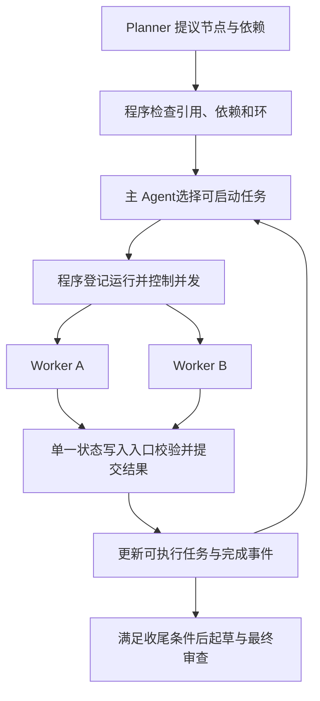

# PRD：多 Agent 任务完成判断、上下文续接与并发调度

日期：2026-10-09。状态：待实现，未验证效果。依据：`面试文档/04_主Agent调度与可审查推理架构.md` 第 12 节及 `runs/ds_multi_S01`。

## 1. 目标与授权范围

本 PRD 供开发 Agent 实现下一版。目标是让已完成的任务正确释放下游，未完成的任务保留上下文继续，让主 Agent 在依赖与 API 配额允许时并发调用 Worker，并让 Reviewer 按完整对象和正确职责审核。

用户此次要求制定方案，代码实现交给另一个 Agent。本文件不代表改动已经完成。开发时先读仓库实际代码、AGENTS.md 与现有规格，保留其他 Agent 的未提交修改。

沿用主 Agent 自主业务调度。Planner 提议任务、依赖和并发建议；主 Agent选择启动、续接、修订和终止；程序校验、执行、保存结果。不能改成程序自动跑完所有 ready 节点，也不能把 S01 的标准路线或数字写进提示。

本方案更新旧规格的 Worker 轮数语义：每次 Worker 调用的最大轮数改为阶段轮数，达到阶段边界后交付进展、允许主 Agent显式续接。主循环最大轮数仍保留；Planner/Reviewer 最大轮数仍保留，最后一轮合法交付不能据此判业务失败。已取消的全局时间/token/调用次数等停止阈值不恢复。单请求超时、有限网络重试、共享 RPM 限速保留。

不修改题库/gold、ETL、财务算法或旧实验包；不新增多进程服务，不迁移全项目到 Agent 框架。单 Agent 默认行为保持兼容。

## 2. 已观察的问题

| 问题 | 运行或代码证据 | 需要改变的行为 |
|---|---|---|
| 最后允许的一轮交付被直接判 blocked | `agent/multi.py` 的 finalized/steps_exhausted 判定 | 按实际交付和节点完成标准判定 |
| 错误状态挡住已有数据的下游 | 7 次 dependency_missing；6 个计划版本 | 已完成结果释放下游，真实缺口保持阻塞 |
| 重开 Worker 容易重复工作 | 每次 SubAgentRunner 创建独立 messages | 保存并续接同一任务上下文 |
| 同一主轮多个子调用依次执行 | multi 主循环及同步 _run_role | 主 Agent授权批次内并发 Worker |
| 审核对象截断、子 Agent无法读 artifact | target_content[:3000]；recall 错误 | 完整结构化读取及分页 |
| 局部节点被要求回答整题 | rev2 对期初取数节点的反馈 | 按节点目标与标准审查 |
| accepted 中仍存在未落实的修订建议 | 残差项与效率效应反馈 | 区分必改项、限制和可选建议 |

本次 DeepSeek 多 Agent 数字核验通过，但 coverage=partial；不能将上述代码改动的预期收益写成实测结论。

## 3. 名词与状态协议

任务 node 保存目标、完成标准和依赖；工具结果 rid 保存取数/计算结果；分析产物 artifact 保存 Worker 交付；claim 把最终答案数字指向 rid；review 保存对对象版本的审查意见。

执行状态保留 pending/running/completed/blocked/failed，增加 paused：

| 状态 | 判定 |
|---|---|
| pending | 未启动，或定义变化后等待重新执行 |
| running | 程序已经启动，尚未完成本阶段 |
| paused | 阶段轮数用完、任务尚未完成，已保存上下文，可显式续接 |
| completed | 本节点必需交付满足协议与确定性检查；仍可能需要语义修订 |
| blocked | 缺本节点必需输入，当前无法继续；保留已有证据和具体障碍 |
| failed | 异常或交付协议失败，保留错误 |

阶段用完不是 blocked 的充分条件。missing_inputs 非空也不是 blocked 的充分条件：必须区分 required_missing_inputs 与 optional_missing_inputs。检查明细可用性的节点，若已经确认缺失并交付限制说明，可完成；要求计算 DSI 的节点若缺期初值，必须阻塞。

Worker 返回 declared_status、completion_report、required_missing_inputs、optional_missing_inputs、next_actions、facts、calculations、hypotheses、limitations、summary。completion_report 按 completion_criteria 的条目报告是否满足及证据引用。程序不信任 Worker 自称完成：检查必需字段、引用、证据类型、输入版本与可确定的数值关系；无法确定的语义事项交 Reviewer。不存在一条通用程序规则可以证明所有业务任务正确。

审核状态与执行状态分开。达到轮数只是阶段事件；answered 是输出状态；verified 是数字核验结果；coverage 是任务覆盖；不能合并成一个 PASS。

## 4. 完成判定与 Worker 续接

1. 保留阶段内收尾机会，最后允许的一轮要求整理已有结果与缺口；正常情况下也允许提前交付。
2. 不再以 finalized 自动判 blocked；finalized 只说明交付发生在预留轮。
3. 对满足完成条件的合法产物，记 completed；缺必需输入记 blocked；仍有可执行动作但阶段耗尽记 paused；协议失败记 failed。
4. paused 返回 continuation_id、实际进度、剩余动作和本阶段消耗。主 Agent显式选择 resume 或结束，程序不自行无限续接。
5. resume 恢复原 messages，包括 assistant 工具调用和 tool 结果、有效输入引用、修订反馈。不重新发送初始任务并丢失已取得结果。
6. 保存 messages 与原始产物供续接使用；trace 面向人工展示必要调用、证据和状态，不声称记录模型完整内部思考。任何凭据都不得写入运行包。
7. 节点定义或输入证据变更后，旧 continuation 不可直接沿用。返回明确失效原因，主 Agent决定新 attempt；历史保留。
8. 没有新证据、重复工具请求、相同错误等生成 no_progress 事件和具体说明，交主 Agent判断；不另加隐含业务停止阈值。

建议新配置 worker_rounds_per_slice=6，兼容读取旧 worker_max_steps 并在元数据说明实际含义。主最大轮数只计主模型请求，程序等待完成不计轮数；模型重试、子请求和阶段消耗另行记录。所有主请求都应计数和写 trace，包括无工具回复。

## 5. 依赖图与业务调度

Planner 继续输出 node_id、goal、depends_on、input_refs、completion_criteria、required_for_answer，可新增 priority_hint、parallel_reason。并发组只是建议，不能绕过依赖；无依赖也不表示必须并发。

程序在每次状态变化后生成 ready_nodes，默认要求前置节点 completed 且所需产物版本有效。paused、blocked、failed 不自动释放需要完整产物的下游。

支持依赖完成产物中的具体输出，明确 required_output_refs；若业务允许使用部分结果，需由主 Agent批准并经结构化校验，不能简单删除边。记录 evidence_dependencies（artifact/rid 及版本）独立于 depends_on：即使调整调度顺序，实际数据使用关系仍用于失效传播。

取数成功是否需要先审核再放行按节点明确 requires_review。默认只读原始数据可走程序检查，关键解释和最终答案需语义审查；不要每次取数都启动模型审核。若关键前置审核要求修订，依赖它的相关结果按版本失效。

就绪列表只包含可启动的 pending 节点；running 不可重复启动，paused 通过 resume 操作。全部节点不在 ready 列表不代表任务完成。

## 6. 并发执行：第一版范围与接口

第一版采用有界线程执行池复用现有同步 LLM 客户端；不强行把同步代码包进 async 后当作已实现非阻塞。未来可替换为异步客户端，接口保持一致。新增 max_concurrent_workers，建议起点为 2，实际值写入元数据；不是新增整题调用次数预算。

新增工具接口（命名可适配现有风格，但语义必须一致）：

- start_analysis_batch(plan_revision, node_ids)：主 Agent显式授权启动；返回每个任务 call_id 与 accepted/rejected 原因。批次中依赖未满足的节点拒绝，独立合法节点仍可启动。不能把同批尚未完成节点当作已满足依赖。
- wait_analysis(call_ids)：程序阻塞等待至少一个完成事件，再返回完成、仍运行及新 ready 节点。不会循环请求模型轮询。
- resume_analysis(continuation_id)：验证版本后续接，返回 call_id。
- read_analysis_object(object_id, section, offset, limit)：父子共用的只读产物/候选/审核读取接口；返回完整字段或分页及是否还有剩余。

单次 wait 最长等待建议 30 秒。若无完成结果，不为轮询立刻调用主模型；程序继续等待并可向用户显示既有运行进度。只有任务完成、失败、用户输入或需业务决策时恢复主模型调用。

实际并发条件是：主 Agent授权、依赖满足、当前无重复任务、存在并发槽位、输入版本有效。占满槽位时返回排队/延后状态，不能丢弃任务；排队启动前重新检查版本和依赖。原 execute_analysis 可作为兼容同步入口，必须复用同一校验与提交规则。

## 7. 并发安全与版本规则

这是第一版实现必查项，不能只把 for 循环改成并发：

1. 每个 Worker 使用独立消息和独立 LLM 客户端或请求局部状态，避免共享 last_call_events、nudged 等字段串扰。客户端共享同一个 RPM 限速器，包括内部重试；RPM=0 只是本地不限速，不证明服务端无配额。
2. 检查 Result Store 已有锁的覆盖范围；rid 分配、缓存查询/写入、结果提交必须保证一致。并发相同查询不得生成相互矛盾的缓存记录。
3. 每个工具调用使用独立或明确安全的数据库连接；不能默认复用单连接可并发。现有 DuckDB 查询实现需要逐项检查。
4. AnalysisState、统计和 trace 通过单一提交入口写入。Worker 返回结果/事件，主线程校验和提交；不让多个线程同时 persist 同一个 JSON。
5. 启动绑定 node_definition_version、input_artifact_versions、attempt、slice、call_id。结束时重新验证这些值。
6. unrelated 节点修订不应废弃其他 Worker 的结果；只因相关节点定义或实际输入变化拒绝旧结果。不能简单要求全局 plan_revision 相等。
7. 第一版修订相关 running 节点时，保留运行记录并将迟到结果标 obsolete，不提交为当前完成产物；尽量避免新旧同节点同时启动。线程中的网络请求不能假装已经取消。
8. 同一 call_id 完成事件重复到达时幂等处理，不重复计数、不重复添加 artifact。
9. 一个独立 Worker 失败不取消其他无依赖 Worker；只阻塞其依赖下游，交主 Agent决定恢复。

## 8. Reviewer 与证据交接

审核输入包含 task_contract、target_type、target_version；节点审查还必须包含 node_goal、completion_criteria、required_outputs 和 relevant_inputs。

删除按字符直接截断结构化对象的做法。初始输入可为完整摘要和目录，但必须提供一致的完整读取工具，Reviewer 能读取 artifact、候选、review 和底层 rid；不得只允许主 Agent读取分析对象。

按 plan/artifact/answer 分别给审核标准。期初取数节点只按取数交付审核，不能要求它独立完成整题归因。无法读取完整对象时登记 input_unavailable，不能把未看到等同于 Worker 未完成。

每个 finding 增加 severity=must_fix/limitation/suggestion、稳定 finding_id、证据引用与响应状态。must_fix 未解决不可 accepted；limitation 可通过明确保留限制收尾；suggestion 可由主 Agent说明采用或不采用。跨候选版本关联修订反馈，不凭相同正文重复审核消除问题。

最终答案继续要求数字 claim 引用 rid、来源 artifact 有效、审查正文哈希与提交一致。保留数字核验与语义审核独立字段。正文数字扫描的负号问题另列 bug 复现，不能为获得 PASS 放宽数值/引用标准。

## 9. 结束、异常与可观测性

无 ready 时：有 running 则等完成；有 paused 则交主 Agent选择续接；必要节点都满足则进入收尾；只有真实 blocked/failed 时报告具体障碍，交主 Agent修订或结束。

允许部分回答，但 task_coverage=partial、unresolved 与限制必须真实保留。确认没有某类数据的核查节点可以 completed；无法计算必需指标不能靠移除依赖或取消 required_for_answer 制造完整覆盖。

主最大轮数到达时停止新启动，保存已有结果和仍运行 call_id。处理已发出请求的完成/失败；不能遗留会在后续实验中悄悄改状态的后台任务。不把运行停止记为所有节点失败。

trace 至少包含 start/queued/resume/checkpoint/complete/blocked/failed/obsolete、依赖拒绝、对象读取、review、no_progress；记录 call_id、节点版本、输入版本、角色、阶段轮数、token、耗时及 API 重试。运行包记录实际配置、最大实测并发、重复工具调用和上下文续接次数。原始对象保存、模型实际看到的摘要/分页和人工报告分别可追踪。

## 10. 实施顺序与建议代码位置

| 顺序 | 改动 | 建议位置 |
|---|---|---|
| 1 | 完成判定，required/optional 缺口，阶段交付 | multi.py、subagents.py、analysis_state.py |
| 2 | continuation 保存与恢复，对象读取统一 | subagents.py、新 continuation 模块、工具 schema |
| 3 | 有界执行池、启动与完成事件、统一提交 | 新 scheduler.py、multi.py |
| 4 | 客户端、限速器、结果库、数据库并发安全 | llm.py、ratelimit.py、result_store.py、tools/data.py |
| 5 | Planner 并发建议、分对象审核、反馈闭环 | prompts/multi、analysis_state.py |
| 6 | 回归与新运行包报告 | tests、CLI 导出、文档 |

先检查已有实现和其他 Agent 改动再选文件，不要求按建议路径重写。保留原同步模式可比较；并发模式显式启用并记录。

## 11. 验收：必须检验真实入口

用 mock LLM、可控事件与时钟检查下列行为，不能只测试绕过工具入口的内部函数：

| 场景 | 必须观察到的结果 |
|---|---|
| 最后一轮交付完整产物 | completed；合法下游可启动 |
| 必需输入缺失 | blocked；保存已有证据；相关下游不能启动 |
| 非必需明细缺失 | 核心任务可完成；限制保留 |
| 阶段用完仍可推进 | paused；resume 保留工具历史，不重取相同证据 |
| A/B 独立，C 依赖 A/B | A/B 执行时间重叠；C 在两者有效完成后才启动 |
| D 独立且很慢 | A/B 完成后 C 可启动，不必等 D |
| 主 Agent未授权 ready 节点 | 程序不擅自启动 |
| 并发槽位、重复启动 | 不超过上限；同一节点不重复 running |
| 一个 Worker 失败 | 无关 Worker 可继续；失败下游受阻 |
| 相关定义/输入在运行中变化 | 迟到结果 obsolete；不覆盖当前任务 |
| 无关节点修订 | 有效 Worker 结果仍可提交 |
| 长 artifact 后半段含错误 | Reviewer 能读取并指出错误 |
| 局部取数节点 | 不以缺整题结论错误退回 |
| must_fix 未回应 | 不能 accepted 或提交为已审通过 |
| 并发 rid、重试事件 | 唯一引用，正确归属，无共享字段串扰 |
| single 路径 | 原有行为与相关测试保持兼容 |

执行受影响测试及仓库要求的离线检查。失败修复后重跑相关项，不反复运行无新信息的全库测试。完成后报告实际改动、检查结果和未解决问题。

在线验证使用独立新目录，沿用用户已授权的真实 API。先确认没有其他 Agent 在跑同一实验；不要并行启动相互争抢配额的实验进程。先一题 S01 验证真实闭环，出现 API 中断保存包并报告，不不断重跑补出 PASS。验证通过后再做同模型、同数据、同提示参数的 single/multi 一次对照；不自动扩展到七题。

比较业务错误纠正、任务范围、真实证据边界、必要任务覆盖、重复取数、输入/输出 tokens、时间和实际并发。不能把速度改善直接解释为质量改善，不能预先承诺 token 降幅。

## 12. 交付要求与参考

交付代码、配置迁移说明、测试结果、新运行包路径和复盘；更新面试文档“已实现/已验证/仍待验证”状态。没有真实验证的能力保持待验证；历史包不修改。不 push，除非用户另行要求。

参考现有范式，不要求新增依赖：

- Python graphlib：get_ready/done 的依赖调度；prepare 后不能修改原图，不能直接承担运行中改计划。https://docs.python.org/3/library/graphlib.html
- LangGraph：动态分发 Send、状态与路由；任意业务任务的完成和依赖协议仍需定义。https://docs.langchain.com/oss/python/langgraph/graph-api
- Prefect：并发任务与 wait_for 依赖。https://docs.prefect.io/v3/how-to-guides/workflows/run-work-concurrently

当前优先复用已有 AnalysisState 和 Result Store，避免为本轮修复迁移整个项目。
