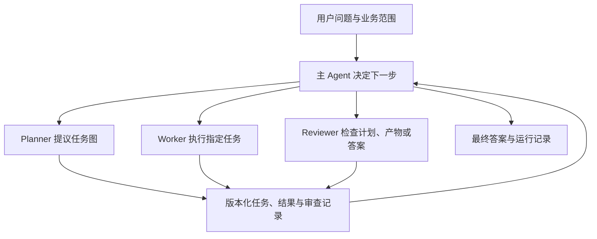
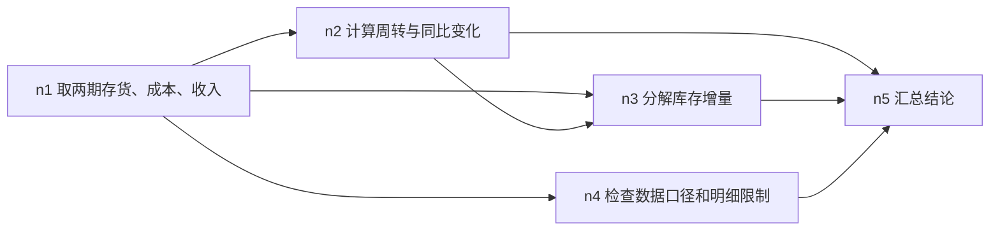
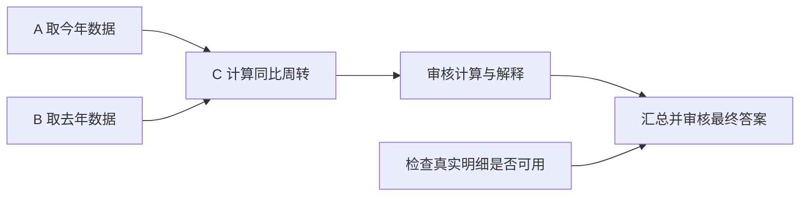

# 主 Agent 调度与可审查推理架构

整理日期：2026-10-06；多 Agent 实验复盘：2026-10-09；调度方案更新：2026-10-09。

本文记录项目里的实验、已实现的多 Agent 架构、第一轮多 Agent 运行暴露的问题及后续调度方案。**方案写入文档不代表代码已经修改或实验已经验证。** 旧 DeepSeek 多 Agent 的 S01 回答通过数字核验，但任务图显示部分完成；2026-10-09 的 V2c 运行已显示 covered，接续、证据交割和审查意见闭合仍有问题，不能据此宣称架构稳定。服务封装、进程级断点续跑和线上监控见[后端设计](05_后端服务与断点续跑设计.md)；其中服务能力仍待实现与验收。

## 1. 项目遇到的问题

项目使用公开财报抽取的结构化数据。第一批归因开发题是 selected_v1 revision 2 的 S01–S07。运行中的 Agent 能看到业务问题和通用业务信息；gold、评分规则和管理层解释留在评测侧。

最早的 S01 实验发现，模型能算出核心 DIO 数字，仍会在解释中混淆同比和环比、把合成明细当成真实经营证据，并对现金来源作出过强判断。后来加入概念定义和部分核验后，S01 能正确写出存货同比 +80.06%、环比 +34.31%，数字核验通过，但人工检查仍发现四类问题：

| 看起来掌握的内容 | 实际错误 |
|---|---|
| 知道同比和环比的定义 | 用户要上年同期，DIO 主分析却改成上季度比较 |
| 算出 z≈3.24 | 因历史均值同号，就认定是正常季节性，选择 no_anomaly |
| 写明明细是合成数据 | 仍用地区和产品线普涨解释真实业务 |
| 知道“同向不等于同因” | 最后仍倾向于认定正常备货 |

第一轮 S01 记录 17 步、输入 270,999 tokens、用时 213.02 秒；第二轮记录 13 步、输入 119,898 tokens、用时 236.42 秒。这只是两次运行的记录，不能据此推断稳定的速度或成本收益。

第二轮 S02 遇到上游 500 错误；S03–S07 遇到 429 限流。只有 S01 有完整的第二轮答案。概念字典和核验协议同时修改，因此不能把结果变化全归因于其中一项。

实验记录：

- [第一轮 S01](../runs/selected_v1_dev/S01/answer.md)
- [第二轮 S01](../runs/selected_v1_dev_round2/S01/answer.md)
- [概念字典交接记录](../docs/handoff_concept_dictionary_verifier.md)

这些问题说明，模型知道概念还不够。系统还要能检查它是否遵守用户指定的范围、是否用对证据、结论是否超过证据支持的程度。

## 2. 多 Agent 架构做什么

架构由一个主 Agent 和三种子 Agent 角色组成。Planner、Worker、Reviewer 可以使用同一个模型；角色差异来自各自的任务说明、可用工具和输入信息。

| 角色 | 负责什么 | 交付什么 |
|---|---|---|
| 主 Agent | 理解用户问题、选择下一步、决定是否并发或改计划、汇总答案 | 调度决定和最终答案 |
| Planner | 把问题拆成有前后关系的任务；根据新证据提出计划修改 | 任务节点、依赖和完成标准 |
| Worker | 为指定任务取数、计算和分析 | 事实、计算、解释、引用和缺口 |
| Reviewer | 按审查对象检查范围、口径、证据和推论 | 具体问题、建议和审查结论 |

Planner、Worker、Reviewer 分别通过 `plan_analysis`、`execute_analysis`、`review_analysis` 供主 Agent 调用。主 Agent负责选择调用哪个角色、什么时候调用、是否接受修改建议。子 Agent 不直接互相调用，也不负责最终对用户作答。

任务图不预先规定唯一解题步骤。它只写清楚要完成什么、需要哪些前置结果。哪些任务能并行，由依赖决定；哪些任务先做，由主 Agent决定。

## 3. 读懂运行记录需要的几个词

| 术语 | 在项目里指什么 |
|---|---|
| node（任务节点） | 一项工作，例如取两期存货，或计算同比 DSI |
| depends_on（依赖） | 某任务开始前必须完成的其他节点 |
| rid（结果编号） | 数据工具返回的编号，例如 `r25`；指向实际取数或计算结果 |
| artifact（分析产物） | Worker 的结构化交付，例如 `art6`，里面有事实、计算、解释和缺口 |
| claim（数字声明） | 最终答案中的一条数字及其出处，例如“DSI 为 55.56 天，引用 r25” |
| review（审查记录） | Reviewer 对某个计划、产物或答案版本的检查结果 |

例如 `r25` 是工具计算结果，`art6` 是 Worker 对任务的交付，claim 把答案里的 55.56 天连接回 `r25`。它们不是同一个东西。

项目把执行状态和审查状态分开保存。`completed` 表示节点满足了自己的交付标准，不表示答案已经通过 Reviewer；`accepted` 表示某次审查接受了某个对象版本，也不表示整张任务图都完成。

执行状态包括 `pending`（等待执行）、`running`（正在运行）、`completed`（完成）、`blocked`（缺必需输入而卡住）和 `failed`（执行或交付失败）。V2 已加入 `paused`：任务达到阶段轮数后暂时交回进展，等待主 Agent决定是否续接。保存 continuation 和提供接续接口已经实现，但实际接续仍有缺陷，也尚未验证完整进程重启后的恢复。

**没有可执行任务，不等于整题完成。** 可能是所有必需节点都完成，也可能是剩余节点都在等待输入。程序需要检查每个必需节点的状态和缺口。

## 4. 多 Agent S01 的任务图

DeepSeek S01 的原始问题要求判断联想 FY2027Q1 库存增长是否反映周转恶化、比较上年同期，并区分数据能支持与不能支持的解释。Planner 最初给出五个任务：

例如，n2 要等 n1 的数据；n5 要等 n2、n3、n4。n2 和 n4 可以在 n1 完成后由主 Agent选择并行执行。

这张图表达的是**任务依赖**，不是业务因果关系。它说明“算周转需要取数结果”，不说明“库存增长由某个业务因素造成”。

## 5. 这一轮 Worker 为什么会被记为 blocked

每个 Worker 调用有一个最大轮数。这里的“轮”是 Worker 与模型之间的一次请求：模型可能要求执行工具，程序执行工具后，再把工具结果交给模型，这才算下一轮。它不是 Planner、主 Agent、Worker 之间排队的步骤数。

当 Worker 用到最后一轮时，程序关闭工具，要求它把已经取得的证据和剩余缺口整理成结构化结果。这是预留的交付机会。Worker 也可以在此前完成并提前交付。

但当前代码把“在最后一轮交付”直接映射成 `blocked`。相关逻辑在 `agent/subagents.py` 和 `agent/multi.py`。这意味着完成判断受交付时机影响：Worker 在较早一轮交付，可能记为 completed；同样内容在最后一轮交付，就可能被记为 blocked。**轮数只说明何时交付，不能单独说明任务是否完成。**

最初的 n1 确实缺上年期初存货，因此当时需要补数，blocked 有实际原因。后来新增的 n7 已算出核心周转指标，但仍因为在收尾轮交付而被记为 blocked。现有 bug 和预期修复的区别是：

| 情况 | 正确状态 |
|---|---|
| 计算同比 DSI，但缺去年的期初存货 | blocked，并记录缺什么 |
| 检查真实分部明细是否存在，确认不存在并说明限制 | 该检查任务可以 completed；业务归因仍受限制 |
| 已完成节点所需计算，只是在最后一轮整理交付 | completed，不能因轮次判 blocked |
| 工具调用报错或没有合法结构化交付 | failed，保留错误信息 |

## 6. “绕路”具体发生了什么

第一轮多 Agent 轨迹里，主 Agent 没有清空任务队列再按顺序推进。它遇到的是：已有结果的节点被记为 blocked，依赖这些节点的任务因此无法启动。之后主 Agent 多次让 Planner 改图，把依赖移除，并让新节点直接读取已有的 rid。

| 主循环轮数 | 动作 | 结果 |
|---|---|---|
| 1–2 | Planner 建立 n1–n5；Worker 执行 n1 | 取得两期合并数据；还缺上年期初存货，n1 记为 blocked |
| 4–5 | 增加 n6 补期初存货；尝试执行 n4 | n6 取得数据但也被记为 blocked；n4 因 n1 未完成而被拒绝 |
| 7–9 | Reviewer 检查 art1/art2；Planner 修改取数任务；再次执行 n1/n6 | 新的 art3/art4 保存了结果，但前置节点仍是 blocked |
| 11 | 尝试 n2、n4 | 两项都因依赖节点未完成而被拒绝，没有启动 Worker |
| 12–13 | Planner 新增自包含的 n7，把取数和周转计算合在一个节点 | n7 产出 art5，核心计算已取得，但仍为 blocked |
| 15–16 | Reviewer 检查 art5；再次尝试 n2/n3/n4 | Reviewer 看不到完整产物；三个任务仍因 n7 状态被拒绝 |
| 17–18 | Planner 把 n2/n3/n4 改成无依赖，直接使用已存在的 rid | 三个 Worker 能启动并交付 art6/art7/art8，但节点仍为 blocked |
| 20–22 | n5 因前置状态被拒绝；Planner 又将汇总改成无依赖 | n5 交付 art9；图中 n6/n7 被设为非必需 |
| 23–38 | Reviewer 审查答案；主 Agent修数字引用和失效 artifact 引用，再提交 | 数字核验通过，答案状态为 answered；任务覆盖仍为 partial |

这次运行有 6 个计划版本、7 次依赖拒绝。补取上年期初存货是必要工作。把已算出的结果重复包装成新节点、删除依赖来绕开错误状态，则是额外开销所在。

“移除依赖”就是把某个节点的 `depends_on` 从 `n7` 改成空列表。程序于是允许它在 n7 未完成时启动。它仍然可能读取 n7 留下的 `r15`、`r16` 等数据。这样，**任务调度关系被删了，但数据使用关系还在。** 如果不另行记录数据依赖，上游数据变化时，程序可能不知道要让哪些下游结果失效。这是基于代码结构的风险判断，本次实验没有专门验证上游更新时的失效传播。

因此，问题不是“任务队列要不要清空”，而是系统必须区分三种情况：有任务正在运行、没有就绪任务但存在真实阻塞、所有必需任务都已交付。清空可执行清单，只能说明当前没有任务能启动，不能证明整题完成。

## 7. Reviewer 为什么偏移

Reviewer 检查三类对象：计划、单个 Worker 产物、最终答案。它们的验收范围不同。

| 审查对象 | 应检查什么 |
|---|---|
| 计划 | 是否覆盖用户问题；依赖是否合理；完成标准能否检查 |
| 取数节点 | 公司、期间、单位、数据来源和节点要求字段是否齐全 |
| 计算/分析节点 | 输入、公式、口径和解释是否符合该节点目标 |
| 最终答案 | 是否回答整题；数字有无出处；结论是否超过证据 |

这次 Reviewer 检查“补取 FY2026Q1 期初存货”的 n6 时，却要求它独立完成 FY2027Q1 周转分析和整题归因。主要原因有三项：审核输入强调了整道用户问题，却没有同时明确传入节点目标和完成标准；Reviewer 只看到 artifact 的前 3,000 个字符；同一套审核提示用于不同类型的对象。

系统还把 Reviewer 的意见和 `accepted` 状态分开得不够清楚。Reviewer 多次建议把“效率效应”说明为残差项，最终答案仍保留“约一半来自效率下降”的措辞。算术拆分闭合，只能说明数字相加正确，不能证明拆出的部分是已确认的经营原因。

因此，Reviewer 必须看完整的审查对象及其版本；审核节点时要看到节点目标和完成标准；反馈要区分必须修正的问题、数据限制和可选建议。Reviewer 看不到证据时，应报告输入不足，不能把“没看到”判成“Worker 没做”。

## 8. 两种模型的结果和改善边界

| 指标 | Agnes 多 Agent M3 | DeepSeek 多 Agent | DeepSeek 单 Agent |
|---|---:|---:|---:|
| 最终状态 | refuse，主轮耗尽 | answered | answered |
| 数字核验 | 未通过 | 通过 | 未通过 |
| 耗时 | 1,754.19 秒 | 314.27 秒 | 33.18 秒 |
| 输入 tokens | 1,528,238 | 2,106,539 | 90,371 |
| 主轮 / 子 Agent 轮 | 40 / 99 | 38 / 90 | 9 / 不适用 |
| Planner / Worker / Reviewer 启动数 | 2 / 10 / 13 | 6 / 9 / 8 | 不适用 |
| 计划版本 / 最终提交打回 | 2 / 5 | 6 / 3 | 不适用 |

DeepSeek 多 Agent 最终答案保持同比主线，给出平均存货口径 DSI 从 47.23 天升至 55.56 天，同比增加 8.33 天，并说明合并数据不能确认具体经营原因。它早期取过 synthetic 明细，但最终没有拿这些明细支撑真实经营归因。

DeepSeek 多 Agent 的运行记录仍显示 `task_coverage_status=partial`，n1–n7 都列在 incomplete 中，人工审查状态是 pending。数字核验通过只说明现有数字和引用规则通过，不能说明任务图全部完成或经营因果成立。

DeepSeek 单 Agent 也保持同比范围，使用了真实合并数据，并指出无法判断主动备货还是被动积压。因此这些改善不能全归功于多 Agent。单 Agent 的核验反馈对负数 `-0.2418` 与正文 `0.2418` 的匹配存在疑点，需要单独检查数字扫描；不能仅凭 verified=False 断定分析内容错误。

两次多 Agent 的模型、运行参数、限速、轮数和 Reviewer 提示不同，不能把耗时差异全部归因于模型。两份多 Agent trace 都没有记录 `llm_retry`。Agnes M3 的记录写明主轮数耗尽，所以不能说这次就是 API 限流造成失败。

## 9. 下一版方案：完成判断、续接和并发

第一轮复盘后，用户决定让另一个 Agent实现下一版。详细范围、接口和验收条件写在[多 Agent 调度 V2 PRD](../docs/prd_multi_agent_scheduler_v2.md)。截至2026-10-09，完成判定、paused与continuation、Reviewer完整对象读取已部分实现，并发执行池和Planner并发建议尚未实现。以下是方案与实现边界；不能把整个PRD当成已经完成。

### 9.1 轮数到期时交付进展，不把任务判失败

当前 Worker 每次调用最多 6 轮，最后一轮被留给结构化交付。新方案把这个限制当作**阶段长度**：

- Worker 已满足节点标准，就交付并记为 completed。
- Worker 缺必需输入，报告缺项并记为 blocked。
- Worker 还有明确工作但本阶段轮数用完，保存聊天消息、工具结果和下一步，记为 paused。
- Worker 工具或协议失败，记为 failed。

主 Agent读到 paused 后，可以选择续接或停止。续接恢复原来的 Worker 上下文，避免重新从空白上下文开始并重复查询。主 Agent自身仍保留最大轮数；不恢复已取消的全局时间、token、调用次数等停止上限。阶段轮数不是无限运行许可，主 Agent需要决定是否继续，实际消耗要记录。

### 9.2 任务图决定“能否启动”，主 Agent决定“启动哪些”

不同问题可以有不同任务图，调度代码不需要理解任务内容。Planner 给每个节点写目标、依赖和完成标准，并建议可同时执行的任务。程序只检查依赖是否完成、输入版本是否有效、节点是否已经运行，以及是否还有并发名额。主 Agent选择本轮启动哪些 ready 节点。

A、B、D 在依赖满足并得到主 Agent授权后，可以同时运行。A 和 B 都完成后，C 可以开始；C 不需要等待 D。F 则需要相关审核和数据限制检查完成。

程序等待 Worker 的完成事件、保存结果并更新就绪清单，不必让主 Agent反复调用模型轮询。没有 ready 任务时，要先检查是否仍有 Worker 运行、是否有 paused 任务，最后才判断所有必需任务是否完成，或确实无法推进。

### 9.3 并发前必须保护证据和状态

第一版方案采用有界线程执行池，复用当前同步客户端。并发数由配置限制，所有 Worker 共享同一个 RPM 限速器。不能把“同时运行多个 Worker”当作绕过服务端配额的方法。

每个 Worker 的消息上下文要相互独立。rid 分配、工具结果写入、AnalysisState 和 trace 需要统一提交入口，避免多个 Worker 同时覆盖状态。Worker 启动时记录任务定义和输入证据的版本；如果这些输入在运行期间变化，迟到结果要标为过期，不能覆盖新结果。实际使用的 artifact/rid 及版本也必须记录，即使 Planner 修订了调度依赖，证据来源仍可追踪。

### 9.4 Reviewer 收到完整材料后按职责审查

Reviewer 要能完整读取 artifact 和答案，不能只看前 3,000 字符。审查任务节点时，输入同时包含原始用户问题、该节点目标、完成标准和相关证据。最终答案审查才按整题范围评价。

每条意见分成“必须修改”“数据限制”或“可选建议”。未处理的必须修改项不能被 accepted 覆盖。答案修改后，旧版本的审核结果不能自动沿用。

### 9.5 借鉴已有项目，但完成标准仍由本项目定义

- [Python graphlib](https://docs.python.org/3/library/graphlib.html)：用相同规则从任务图中取出 ready 节点，并在任务完成后释放下游。它不负责运行 Worker 或处理动态改图。
- [LangGraph Graph API](https://docs.langchain.com/oss/python/langgraph/graph-api)：提供共享状态、路由和动态并行分发的实现范式。财务任务的证据与完成标准仍需项目自己定义。
- [Prefect 并发任务](https://docs.prefect.io/v3/how-to-guides/workflows/run-work-concurrently)：展示如何并发运行任务并声明等待依赖。
- [Anthropic 多 Agent 研究系统](https://www.anthropic.com/engineering/multi-agent-research-system)：强调给子任务写清目标、输出格式、工具与任务边界。
- [Anthropic Agent 工作流](https://www.anthropic.com/engineering/building-effective-agents)：介绍由一个角色生成、另一个角色按明确标准评价并反馈的模式。

V2c 已完成一题S01运行。与旧DeepSeek多Agent相比，计划版本从6减至3，依赖缺失拒绝从7次降为0，任务覆盖从partial变为covered；输入Token从2,106,539降至1,568,385，耗时从314.27秒增至346.45秒。两次最终数字核验都通过，不能据此证明答案质量稳定提高。轨迹显示，两次接续都未继续工具执行；Worker曾给出当时不存在的输出rid；修改后的产物通过审查后，旧must_fix意见仍未正确关联关闭。后端续跑必须修复这些状态与交割问题，再验证新进程加载，而不是直接把现有continuation包装成可靠恢复。运行包见[旧S01](../runs/ds_multi_S01/run_meta.json)与[V2c S01](../runs/prd_v2c_multi_S01/run_meta.json)。

## 10. 面试讲述建议

> 我们在财报归因项目中先观察到，单 Agent 会混淆比较范围、误用合成数据，并把观察结果说成经营原因。后来实现主 Agent调用Planner、Worker和Reviewer。第一轮暴露了合法交付误记blocked、Reviewer输入不完整等问题。V2修正了部分完成判定与审查读取，S01任务覆盖变为covered，输入Token减少，但耗时增加，接续仍没有真正继续执行工具。下一步收尾是将分析包装成异步服务，保存主调度、任务图和证据检查点，用进程故障试验验证恢复。任务内部并发和稳定正确率收益仍未验证。

面试时应按个人实际贡献说明方案、实现和实验分别由谁完成。当前可以陈述已有实验和代码中实际存在的多 Agent 框架；新调度方案、并发收益、跨公司泛化和稳定正确率提升仍待实现或验证。

## 11. 研究参考与边界

以下资料用于形成设计方案，不代表本项目已复现论文或框架效果：

- [Data Interpreter](https://arxiv.org/html/2402.18679v1)：动态任务依赖和代码执行验证；[代码](https://github.com/FoundationAgents/MetaGPT/blob/main/metagpt/roles/di/data_interpreter.py)。
- [SWE-agent 接口设计](https://github.com/SWE-agent/SWE-agent/blob/main/docs/background/aci.md)：工具接口通过具体反馈约束 Agent 动作。
- [PlanGEN](https://arxiv.org/html/2502.16111v1)：任务约束和计划审查。
- [CRITIC](https://arxiv.org/abs/2305.11738)：通过外部工具反馈帮助纠错。
- [ACE](https://arxiv.org/html/2510.04618v1) 及[代码](https://github.com/ace-agent/ace)：从运行轨迹增量维护通用 playbook。
- [GEPA](https://arxiv.org/abs/2507.19457) 及[代码](https://github.com/gepa-ai/gepa)：用轨迹和评测反馈改进系统文本组件。

本项目所说的“免训练”，指不更新基础模型权重；系统仍需要模型调用、人工反馈和验证。保存的任务、证据和审查记录是可检查的工作材料，不等于完整展示模型内部推理。任务图结构正确也不能单独证明经营因果。
