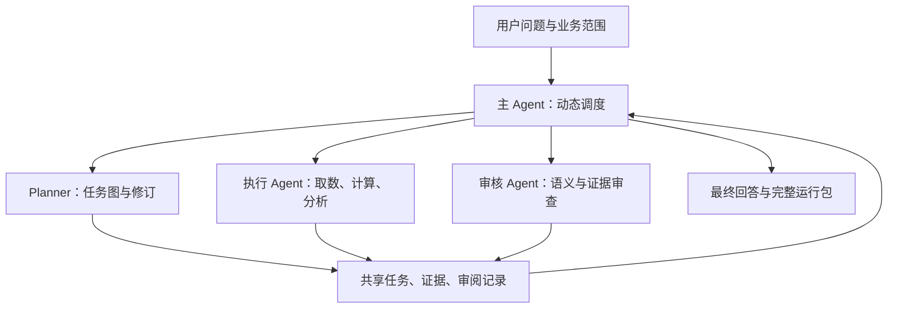

# 主 Agent 调度与可审查推理架构

整理日期：2026-10-06。

本文记录两轮实验观察、用户与审核模型确定的设计，以及建议的工程实现。三种子 Agent 调度架构尚未实现、尚未验证收益；本文不是已完成架构的验收报告。上一份选题文档中的“尚未跑基线”是 2026-10-05 当时状态，当前实验进展以本文为准。

## 1. 问题背景：为什么概念解释还不够

项目使用公开财报抽取的结构化财务数据。首批归因开发题为 selected_v1 revision 2 的 S01–S07；运行侧只获得业务问题与通用业务元数据，gold、评分断言和管理层解释留在评估侧。

第一轮中，S01 的核心 DIO 数字正确，却在后续分析中混淆同比与环比、使用合成明细解释真实业务，并对现金来源作出过强判断。最终又因正文主观置信度与核验规则冲突而未通过核验。

第二轮加入概念定义与部分核验修复后，S01 可以正确区分库存同比 +80.06% 和环比 +34.31%，最终 verified=True。但进一步人工检查发现：

| 观察 | 具体问题 | 暴露的系统能力缺口 |
|---|---|---|
| 知道同比与环比定义 | 用户要求上年同期，DIO 主分析却换成上季比较 | 没有持续保持任务范围 |
| 得到 z≈3.24 | 因历史均值同号而认定正常季节性，选择 no_anomaly | 没有检查前提与结论一致性 |
| 明示明细为合成 | 仍使用地区/产品线普涨支撑真实经营结论 | 没有落实证据使用边界 |
| 知道同向不等于同因 | 最终仍倾向认定正常备货 | 假设与已支持结论没有分开 |

两轮 S01 对照：第一轮 17 步、累计输入 270,999 tokens、213.02 秒；第二轮 13 步、119,898 tokens、236.42 秒。记录的是这两次实际运行，不据此声称稳定的效率收益。

第二轮 S02 因上游 500 中断，S03–S07 因 429 限流中断。只有 S01 有完整第二轮答案，不能宣布七题正确率改善；概念解释和核验协议同时修改，也不能把变化全部归因于字典。

证据位置：

- `runs/selected_v1_dev/S01/answer.md`、`trace.jsonl`、`run_meta.json`。
- `runs/selected_v1_dev_round2/S01/answer.md`、`trace.jsonl`、`results.json`、`run_meta.json`。
- `docs/handoff_concept_dictionary_verifier.md`：前一轮开发交接。

由此得到的设计判断：提供知识有帮助，但系统还需要追踪任务是否完成、证据是否可用、结论是否与证据相容。仅要求模型写更多解释或重复反思不足以实现这些目标。

## 2. 解决方案：主 Agent 自由调度三种角色

采用“主 Agent + 三类子 Agent 工具”的架构：

| 角色 | 核心职责 | 输出 |
|---|---|---|
| 主 Agent | 理解全局、选择下一任务、调用子 Agent、调整计划、组织最终回答 | 调度动作、计划修订请求、最终回答 |
| Planner | 生成或修订有依赖的任务图 | 节点、依赖、完成条件、待澄清内容 |
| 执行 Agent | 为指定节点调用数据工具、计算、分析 | 结果、引用、计算依据、缺口、状态 |
| 审核 Agent | 检查计划、节点分析或最终回答的语义与证据关系 | 有依据的问题清单、修订建议、审阅状态 |

三种角色以 `plan_analysis`、`execute_analysis`、`review_analysis` 工具暴露给主 Agent。主 Agent 决定调用顺序、是否并行、什么时候重新规划、将哪个问题退回哪个节点。不是由程序预先写死整条业务执行时序。

三种角色不意味着必须使用三种模型，也不意味着每次启动三个进程。第一版可用同一模型、不同角色提示与独立上下文；模型与调用参数按角色配置，并在运行包记录。主 Agent 保留全局状态，子 Agent 仅接收完成任务所需的信息。



这张图表示职责与信息流，不规定每个问题必须经过相同调用次数。

## 3. 任务图是什么：约束与依赖，不是固定思维链

任务图表达“需要完成什么、依赖什么”，不预写答案，也不要求唯一推理路线。Planner 可以根据工具反馈建议增加、缩减或替换节点，主 Agent 决定是否接受。

例如周转分析可以规划为：

1. 明确用户指定的公司、期间、比较基准与口径。
2. 取得可比期间的真实余额、发生额与周转结果。
3. 量化周转变化并解释公式输入的相对变化。
4. 根据已有证据提出经营假设、反向证据与缺口。
5. 审阅并组织回答。

数据节点完成后计算节点才能使用其结果；经营假设节点应依赖经过检查的事实。同行、季节性、结构明细是否需要增加，由主 Agent 和 Planner 按问题决定，不强制全部执行。

程序可计算 ready/blocked 状态、验证依赖是否存在，但不替主 Agent选择下一个业务分析节点。主 Agent 可以选择就绪节点、申请修订图或报告无法推进。

任务依赖图保持无环；“审核→修订→复审”是同一节点的新 attempt 或新 plan revision，不通过把边反向接回旧节点制造依赖环。

## 4. 工程实践：复用现有循环，增加子 Agent 工具

### 4.1 复用基础能力

现有 `agent/loop.py` 已有模型—工具循环、预算、trace 和最终提交钩子；`agent/tools/data.py` 有财务工具；`agent/result_store.py` 有 rid 引用；`agent/verifier.py` 有数字核验。优先在这些能力上扩展，不为了多 Agent 重写数据层。

建议新增一个子 Agent 调用模块、结构化协议与角色提示文件，具体路径由开发者结合目录习惯确定。本轮本文只定义方案，不修改这些代码。

### 4.2 子 Agent 工具协议

| 工具 | 主 Agent 提供 | 子 Agent 返回 |
|---|---|---|
| plan_analysis | 任务约束、当前图版本、已知证据摘要、修订原因 | 结构化计划或计划修订建议 |
| execute_analysis | 图版本、节点 ID、交付目标、输入 artifact/rid、预算 | 结果 artifact、证据、简短分析、执行状态 |
| review_analysis | 图版本、审查目标 artifact、用户要求、相关证据与已知规则 | findings、具体引用、建议、审阅结论 |

参数与返回值使用可验证 schema。角色提示不作为唯一权限控制：

- Planner 不得修改数据库，不得宣称未执行的计算已经完成。
- 执行 Agent 使用只读数据工具与受控计算工具，不能修改评测数据或自己的评分。
- 审核 Agent 可以查验只读证据与必要计算，但不能悄悄替执行节点改结果。
- 第一版只有主 Agent 能调用子 Agent 工具，子 Agent 不递归生成其他子 Agent，避免不可控调用树。

### 4.3 最小共享状态

共享的是版本化对象，而不是把所有聊天历史复制给每个子 Agent：

| 对象 | 建议字段 |
|---|---|
| task_contract | 原始 query、company、period、comparison、scope、输出要求、限制 |
| plan | plan_id、revision、nodes、dependencies、可追踪修订原因 |
| node | node_id、goal、input_refs、completion_criteria、execution_status、attempt |
| analysis_artifact | artifact_id、node_id、plan_revision、facts、calculations、hypotheses、limitations、evidence_refs |
| review | review_id、target_artifact_id/version、findings、verdict、unresolved_items |

任务约束由系统解析已有明确范围，模糊部分由主 Agent 澄清；不能靠 Planner 自行猜测后默默覆盖。修改用户明确要求需要新的用户指令。

区分执行状态和审核状态：工具执行成功不等于分析通过；节点可能 execution=completed、review=needs_revision。允许 blocked/missing_data/inconclusive，不把缺证据一律算代码错误。

### 4.4 证据共享与出处

- 同一运行内 rid 唯一。复用统一 Result Store，或通过主控原子导入子结果并重映射引用；不能让多个子 Agent 各自产生同名 r1。
- 结果保存公司、期间、比较期、单位、计算输入、数据性质、data_version 和概念字典版本。
- 模型可见的是必要的结果与分析摘要；完整行通过已有 recall/只读接口获得。
- 不将“模型写了一个数字”当作证据。派生结果需保留输入 rid 与表达式，常量 calc 不会自动变成已证实的财务事实。
- 子 Agent 的自然语言摘要不能覆盖原始数据；后续审查能返回原始证据。
- 合成数据可用于调试工具，不得作为真实经营结论的支撑。未知来源保持 unknown。

### 4.5 程序的职责：保障状态真实性，不决定分析路线

程序承担 schema/依赖校验、只读权限、预算、并发限制、trace、artifact 持久化和确定性核验。返回可操作的问题，由主 Agent 决定补数、修订、复审或终止。

例如：执行节点缺少依赖结果时，程序返回 dependency_missing，而不是自行安排整套补数流程。主 Agent 也可以请求 Planner 修订依赖，不必永远沿初始图执行。

## 5. 如何审查：确定规则与语义判断分开

### 5.1 程序适合检查的内容

期间和比较基准、单位、公式输入、引用是否存在、勾稽、合成标记、声明的任务交付物是否齐全。可检查结构化记录中的同比比较是否与 contract 一致；自然语言是否忠实表达仍需语义审阅。

现有 verifier 只覆盖其中一部分。新增图、artifact 和来源检查需要实现，不能将这张清单描述为已经具备的能力。

### 5.2 审核 Agent 适合检查的内容

- 是否回答用户的主问题，补充分析是否替代了主分析。
- 结论与计算结果、分类规则是否矛盾。
- 证据支持到哪一层：观察事实、数学解释、经营假设还是已确认原因。
- 是否把“不能证明 A”推成“证明非 A”或“证明 B”。
- 是否忽略合理竞争解释，是否说明区分这些解释所需的数据。

审核输出应具体，例如：

```json
{
  "target_artifact_id": "a_turnover_v1",
  "verdict": "needs_revision",
  "findings": [{
    "category": "task_scope",
    "statement": "当前主分析只覆盖上季 DIO，未覆盖用户要求的上年同期",
    "evidence_refs": ["task_contract.comparison", "a_turnover_v1.comparison"],
    "suggested_action": "补齐同比周转比较，将环比保留为补充"
  }]
}
```

不要只输出“逻辑不够严谨”或一个总分。审核模型也可能出错；主 Agent 可补充证据、请求针对性复审，仍有分歧时保留 unresolved，不无限辩论。

### 5.3 审查节点与最终回答

不强制每次取数都调用审核模型。原始数值和计算先走程序检查；关键分析节点、计划明显变化和最终答案进行语义审查。

最终审查必须覆盖主 Agent 汇总后的答案，因为汇总时也可能新增、删减或夸大结论。最终版本修改后，旧审核不能自动视为仍有效。输出业务事实与假设需要有对应 artifact/证据；核验通过、审核通过、人工业务评价分别记录。

## 6. 一次运行的具体例子

用户要求比较上年同期的库存周转。

1. 主 Agent 获取固定业务范围，调用 Planner 生成初始图。
2. Planner 返回同比取数、周转量化、指标解释、经营假设等节点。
3. 主 Agent 选择就绪任务，调用执行 Agent；工具返回数字及概念定义。
4. 执行 Agent 返回周转分析 artifact；如果只有环比，审查报告主任务未完成。
5. 主 Agent 将具体反馈交给执行 Agent，补充同比；如果缺真实数据，向 Planner 请求改计划或说明边界。
6. 审核 Agent 检查是否仍将合成明细用于经营解释、是否把历史同方向误作正常幅度。
7. 主 Agent 汇总事实、解释、假设和缺口，提交最终审查与数字核验。
8. 保存完整运行包。预算耗尽或证据不足时保留部分结果与真实状态。

这是一种可能的路径，不在程序中硬编码第一题标准答案，也不以强制命中题库 gold 作为运行条件。

## 7. 成本、并发与恢复

- 父子调用共享总 token、时间、模型请求和修订预算；子 Agent 不能各自获得一套无限预算。
- 第一版保守设置最大并发和最大子任务数，依据实际 API 配额调整。不同角色使用同一 key 时，共享同一个限流器。
- 多 Agent 首先是职责和上下文划分，不必使用多进程。API 密集场景可使用异步调用；独立就绪节点才适合并行，共享状态写入需原子提交。
- 程序拒绝访问依赖尚未完成或版本不匹配的 artifact，主 Agent选择等待、改计划或终止。
- 有效异步调用返回 call_id，完成后再读取结果；主 Agent 未拿到结果时不能把节点标为完成。也可先用简单的同步工具调用验证架构。
- API 429/500、工具错误、语义不通过分别记录。恢复时复用已完成 artifact，避免静默从头重跑或覆写旧实验。
- 预算或修订次数达到上限时，报告 unresolved 与未完成节点，不能仅靠删掉争议段落制造 PASS。

## 8. 如何验证方案是否有用

先用离线 mock 验证权限、依赖、版本、父子预算、错误保存和引用唯一性，再运行真实开发题。离线重点包括“缺依赖不能假装完成”“计划修订后旧审核不能直接放行”“子 Agent 无法递归扩展调用树”。

真实验证沿用每题每版本一次；选定固定模型、参数、数据与预算，并记录新增调度开销。API 中断项标为运行未完成，不作为推理错误。

比较以下结果，而非只看 verified：

| 维度 | 观察指标 |
|---|---|
| 端到端质量 | 人工评审的核心事实正确性、解释质量、边界、主任务覆盖 |
| 取数与计算 | 公司/期间/单位正确性、必要输入是否取得、计算出处完整性 |
| 审核有效性 | 抓到的真实错误、误报、修订后是否纠正、是否引入新错误 |
| 运行可靠性 | 正常完成/API 中断/预算终止，父子调用成本、时间、循环与重复取数 |

记录最早偏离任务的节点，以及反馈后错误是否真正改变。不能把“多调用一次审核”当成收益。

S01–S07 是开发集，不是独立留出集。后续在其他事件组和可比公司验证泛化；审批通过的规则不得携带案例答案或评估侧原文进入运行上下文。

## 9. 从失败轨迹沉淀经验：为什么不是一个案例一个 skill

bad case 是诊断材料，skill 只是修复方式之一。多个案例可共享错误机制，一个案例也可能暴露多个机制：

| 机制 | 可出现的案例 | 更合适的沉淀方式 |
|---|---|---|
| 未保持用户范围 | 同比换环比、季度换半年、集团换分部 | task_contract 与完成检查 |
| 指标理解错误 | 平均/期末混用、百分比/百分点混用 | 概念字典与工具口径 |
| 不合格证据被使用 | 合成明细解释真实业务、缺来源数字 | 来源标记、权限与证据检查 |
| 逻辑越界 | 现金上涨推出库存不占款、未证明失控推出正常备货 | 通用 playbook 与语义审核 |
| 运行故障 | 限流、超时、上下文或预算耗尽 | 调度与恢复机制 |

经验条目应包含触发条件、错误机制、适用规则、执行/检查方式、来源案例、验证案例、版本与已知边界。少量通用方法可组织为 skill，但不把每个历史答案包装为 skill。

当前坚持人工介入：用户与审核模型诊断并批准经验，开发模型实现；新版本验证后才纳入正式规则。案例用于回归，规则用于迁移。

## 10. 研究依据与应用边界

以下是设计参考，不是已经在本项目复现的效果：

- [Data Interpreter](https://arxiv.org/html/2402.18679v1)：动态任务依赖、代码执行与验证；[代码](https://github.com/FoundationAgents/MetaGPT/blob/main/metagpt/roles/di/data_interpreter.py)。借鉴任务状态和中间产物，不假定它的验证能证明经营因果。
- [SWE-agent 接口设计](https://github.com/SWE-agent/SWE-agent/blob/main/docs/background/aci.md)：工具接口与具体执行反馈约束动作。借鉴可检查接口，不只靠提示提醒。
- [PlanGEN](https://arxiv.org/html/2502.16111v1)：任务约束与计划审查。借鉴约束检查，不复制高成本多候选搜索。
- [CRITIC](https://arxiv.org/abs/2305.11738)：通过外部工具反馈纠错。借鉴可追踪反馈，而非无依据反思。
- [ACE](https://arxiv.org/html/2510.04618v1)、[代码](https://github.com/ace-agent/ace)：从轨迹提炼并增量维护通用 playbook，不更新模型权重。
- [GEPA](https://arxiv.org/abs/2507.19457)、[代码](https://github.com/gepa-ai/gepa)：用轨迹和评测反馈改进系统文本组件；当前先人工验证，不自动搜索。

所谓“免训练”，在这里指不更新基础模型权重；仍需要推理调用、人工反馈与验证成本。外部分析记录是可检查的工作产物，不等于完整揭示模型内部思考，也不能用形式上完整的图证明因果正确。

## 11. 面试讲述示例与事实边界

> 我参与了一个基于公开财报结构化数据的归因 Agent 项目。第一轮发现模型虽然能算对周转指标，但会混淆同比环比、误用合成明细。加入概念解释后，第一题的口径表述改善并通过数字核验，但仍把同比任务换成环比，并作出过强经营结论。因此我把问题定位到任务保持、证据使用和结论一致性，提出主 Agent 调度规划、执行、审核三种角色的方案。任务图描述依赖与完成条件，主 Agent 自由调度；程序保存真实状态并做确定性检查，审核模型负责语义问题。我们计划按版本运行开发题，人工检查审核是否真正纠错，再把经验提炼为通用规则。

当前可以讲已经完成的实验观察、问题定位与架构设计。架构实现、正确率提升和跨公司泛化仍待验证；不说多 Agent 已经解决了因果分析，不宣称预测能力已经涌现。个人贡献按实际说明，其他模型完成的代码不说成全部独立编写。
