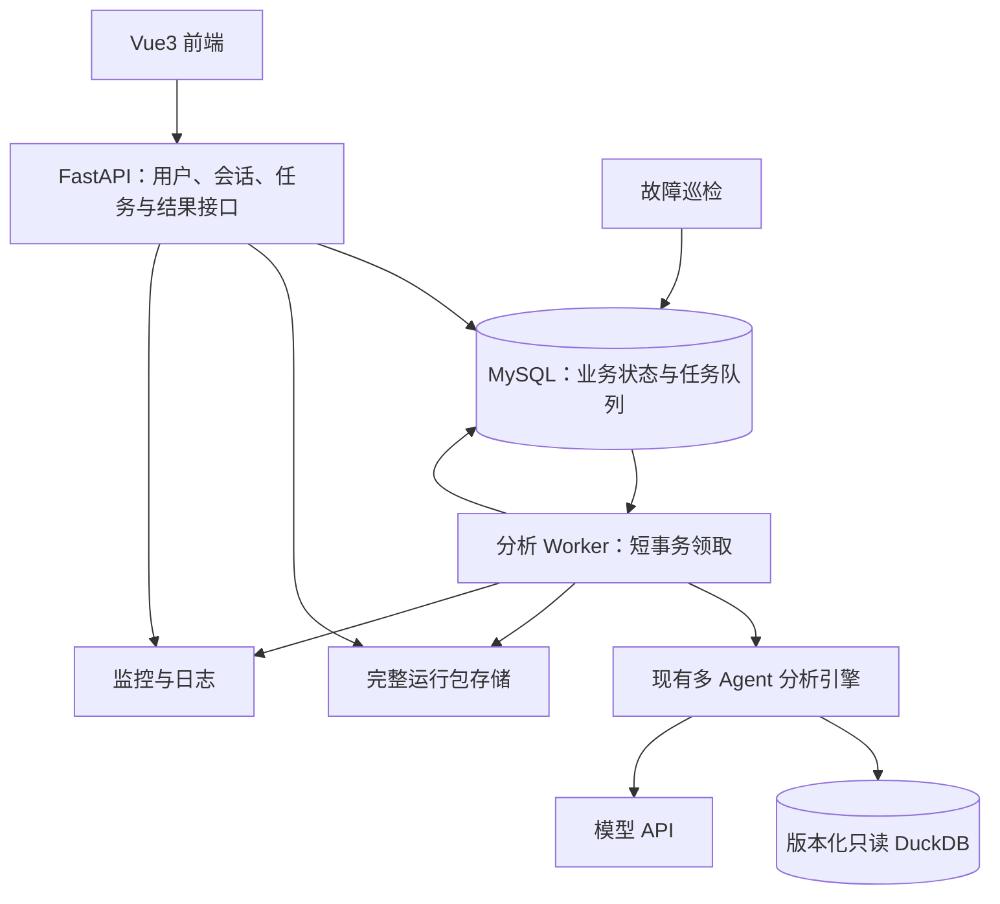

# 后端服务、断点续跑与线上监控设计

日期：2026-10-09。状态：后端设计完成，服务代码与故障验收待完成。

本文用于面试讲解，详细实现合同见[后端服务 PRD](../docs/prd_backend_service_v1.md)。已有能力是财务数据分析引擎、任务图、证据引用、审查记录和运行包；本文的登录、任务队列、跨进程恢复和监控属于下一步工程设计。个人贡献、实现与验收结果应分别说明，不能把设计写成上线成绩。

## 1. 从分析程序到用户能使用的服务

项目面向领导班子的复杂财务分析。一道问题可能需要取数、计算、比较、检查证据和多轮审查，执行时间较长。当前用户通过命令行启动，运行结束后查看答案和轨迹。后端要让用户登录后提交问题，离开页面后任务继续运行，返回时能看到进度、答案、证据和失败原因。

本轮收尾优先完成可部署的内部试用版。保留已验证的分析流程，把工程工作放在用户隔离、异步执行、可靠保存、断点续跑和故障处理上。支持多少并发、能否自动故障切换，必须通过测试后再给结论。

## 2. 架构与各组件的职责

| 组件 | 为什么放在这里 |
|---|---|
| FastAPI | 提供鉴权、会话、任务提交和查询接口；请求被接受后立即返回任务编号 |
| MySQL | 保存用户、消息、任务状态、上下文快照、检查点和证据；事务保证相关更新一起成功或一起失败 |
| 独立 Python Worker | 通过 MySQL 领取任务；与 API 分进程运行，可分别扩容 |
| MySQL 限流表 | 多 Worker 共用模型 RPM 与并发额度；短事务修改，模型调用期间不持有数据库锁 |
| 分析 Worker | 领取任务、调用现有分析引擎、保存阶段状态和结果 |
| DuckDB | 保留已有财务查询工具，只读加载固定数据版本；本轮避免同时重写分析数据层 |
| 文件存储 | 保存完整轨迹和下载运行包；恢复必需的结构化状态优先保存到 MySQL |

前后端按接口分离开发，部署时可由反向代理提供同域 HTTPS 入口。后端先保持模块化单体，API 和 Worker 用不同进程运行，不需要在收尾阶段拆成很多微服务。

现有 `run_multi()` 是同步循环，可以放进独立 Worker。服务层还需要提取统一的引擎适配接口，每次运行创建自己的消息、结果库、模型客户端和输出目录，避免不同用户相互污染。

## 3. 用户提交后发生什么

1. 用户提交问题，FastAPI 校验身份、会话归属、活动任务和额度。
2. MySQL 在一个事务里保存用户消息、本次输入快照、任务和待投递记录。
3. API 返回 `202 Accepted` 与 run_id，用户看到排队状态。
4. Worker 从 MySQL 领取任务后开始分析。
5. Worker 保存取数、计算、审查等阶段事件，以及可以恢复的检查点。
6. 最终交付通过相应检查后，事务保存答案和结束状态；前端读到结果。

P0 前端定期查询新增事件即可。后续增加 SSE，即服务器持续向浏览器推送事件的连接。事件有顺序编号，浏览器断线后可以从上次编号继续读取；关闭连接不会停止分析。

普通用户看到排队、取数、计算、审查、暂停或失败，以及答案引用的证据。完整模型消息和工具日志由管理员按权限检查。保存轨迹不等于展示模型内部思维。

主要接口是创建会话、提交运行、查询运行、读取事件与证据、暂停、取消和恢复。提交和恢复带唯一请求编号：浏览器因网络重试再次发送相同请求时，服务返回已有任务，避免重复消耗。

## 4. 鉴权与上下文管理

第一版使用内部账户，密码保存哈希。登录后浏览器携带安全 Cookie，服务查询有效会话。以后可接企业 SSO。所有会话、任务和证据都检查用户归属，不能仅检查“已登录”；否则用户更换 run_id 就可能访问别人的答案。

会话历史和模型上下文是两份不同的数据：

| 数据 | 保存与使用 |
|---|---|
| 完整会话历史 | 保存全部用户问题和最终回答，供用户查看 |
| 本次上下文快照 | 保存经过选择的历史、当前问题、确认条件和证据，实际送给模型 |
| 历史摘要 | 后续用于压缩较早消息；需要记录来源，不能代替数字证据 |

P0 先按明确的 Token 预算选择历史并记录省略范围，后续再加入摘要。每次运行的上下文在提交时冻结，运行中新增消息不能偷偷改变原问题。用户追问历史数字时，系统加载对应证据或重新取数，而不是把上次答案中的数字直接当事实。

同一个会话先限制为一个活动任务，paused 任务也占用这个位置，避免两个任务同时修改上下文。不同会话可以并行运行。证据编号用 `(run_id, rid)` 定位，因为每次运行都可能产生 `r1`。

## 5. 任务可靠性：MySQL 队列如何处理并发和故障

Worker 可能崩溃，也可能在领取后失去连接。因此还要处理执行权和结果发布。第一版让 MySQL 同时保存任务状态和待执行任务，不另设需要协调的队列。

### 5.1 创建成功但没有投递

API 在一个 MySQL 事务中保存用户消息、上下文快照和 queued 任务。事务提交后，Worker 轮询同一张任务表，无需把任务消息发送到另一套系统。

Worker 使用 `SELECT ... FOR UPDATE SKIP LOCKED` 和短事务领取不同任务，更新租约与执行版本后立即提交，再在事务外执行分析。MySQL 官方说明该读法适用于减少队列表的锁竞争，但结果会跳过已锁行，因此仅用于任务领取。[MySQL 锁定读文档](https://dev.mysql.com/doc/refman/8.0/en/innodb-locking-reads.html)

巡检程序查找租约过期任务，有限次数转为 recovering。Worker 崩溃后，任务仍在 MySQL，另一个 Worker 可以恢复。MySQL 暂时不可用时停止领取和写入，连接恢复后从持久化状态继续。

### 5.2 旧 Worker 恢复后继续写入

Worker 领取任务时取得有到期时间的执行权，并定期发心跳。执行权到期后，巡检程序才允许接管。

每次领取还会递增执行版本号。保存证据、检查点和最终答案时，都必须带当前版本。旧 Worker 即使恢复运行，也无法覆盖新 Worker 的结果。执行权更新和检查使用短数据库事务，不在模型请求期间持有数据库锁。

### 5.3 最终答案只发布一次

最终答案、会话里的 assistant 消息、任务终态和结束事件在一个事务内提交。重复提交只能得到已发布结果。用户取消标记也在这个事务中再次检查，防止取消后迟到的模型响应继续发布答案。

这里保证的是已提交业务结果不会重复发布。模型已经返回、结果尚未保存时发生崩溃，仍然可能重复调用模型，不能承诺每次模型请求只执行一次。

## 6. 断点续跑保存什么，如何恢复

检查点是恢复执行所需的状态快照。只保存问题和答案不够，恢复程序需要知道原计划、已有证据、完成的工作和下一步位置。

| 必需状态 | 恢复时的作用 |
|---|---|
| 用户输入、数据和执行配置版本 | 保持原来的分析范围与环境 |
| 主 Agent 消息、轮数和待处理调用 | 继续调度，不重新从空计划开始 |
| 任务图与节点状态 | 确定哪些任务完成、哪些需要继续 |
| 完整工具结果、rid 和证据账本 | 继续引用真实数据，防止编号重复或错配 |
| 产物、审查及对象版本 | 复用仍有效的工作，保留必须修正的问题 |
| 子 Agent 消息与阶段交付 | 后续支持节点内部继续执行 |
| 累计用量和执行记录 | 保留真实消耗，不因恢复清零 |

第一版先在计划、节点交付、审查和答案候选等安全边界保存。相关状态一起提交到 MySQL，提交成功后才释放下游任务。恢复程序加载这些记录后，真正重建分析上下文并继续执行；文件里有日志但程序不加载，不算续跑。

例子：取数节点和计算节点已经完成并保存，解释节点执行到一半时进程崩溃。新 Worker 加载检查点，保留取数和计算结果，重新执行尚未提交的解释节点，继续审查和汇总。取数与计算工具的调用次数应保持不变，这是验收能直接核对的证据。

后续再细化到节点内部：每次工具执行完成后，保存工具结果及配对的模型消息。恢复时保留历史，追加新的继续执行指令。上一阶段的“停止调用工具并交付”不能成为恢复后的永久限制。

当前代码已有 continuation，但上一轮轨迹显示，新接续指令没有进入模型输入，接续后仍然停止工具调用。主循环也需要显式加载持久化状态。可靠的进程级续跑仍待实现，不能把现有接口存在当成验收通过。

### 恢复条件和失败边界

系统只恢复有效检查点，固定原数据、提示词和 Skill 版本。版本不兼容、证据缺失或检查点损坏时，返回具体原因，不能假装恢复后从头分析。每次恢复沿用 run_id，新建一次执行记录，便于区分正常执行和故障恢复。

暂停允许继续，取消任务第一版需要重新创建运行。缺业务数据的 blocked 不会因为换一个 Worker 就消失，需要补输入或形成明确的澄清/拒答。自动恢复有次数上限，防止确定性错误反复消耗。

节点状态与整次运行状态分别保存。某节点 paused 可能被主 Agent继续调度；整次运行 paused 表示已经保存状态并停止占用 Worker。不能把这两种暂停混在一起。

## 7. 并发、限流和高可用

API 并发负责快速接受和查询请求；Worker 并发负责同时执行不同分析；任务内部并发负责同时执行不同子任务。三者需要分别配置、分别测试。当前后端设计先支持多个会话任务，保留原来的任务内部执行方式。

共享模型额度先由 MySQL 按供应商/API Key 别名维护限流计数，主 Agent 和所有子 Agent 都经过同一入口。限流控制每分钟请求数、同时调用数，以及供应商要求的 Token 额度。多个 Worker 共用同一计数。遇到429有限退避，按供应商要求等待；参数和权限错误不盲目重试。只有压测发现限流行的锁等待影响数据库查询，才将限流器迁到 Redis。

排队可以吸收短时流量，但请求长期超过模型处理能力时，等待时间仍然增长。要限制队列和每用户活动任务，在页面说明繁忙状态。服务设置累计预算，达到上限保存进度并暂停，恢复后不自动清零。

部署遵循联想批准的主机或应用运行方式，不要求 Docker。高可用扩展包括 API 多副本、Worker 多机器、共享产物存储和 MySQL 主备。任务状态存于数据库，API 副本不保存唯一状态。若 MySQL 队列经压测显示影响业务查询，再评估加入 Redis/Celery。

单机部署和进程自动重启不能证明高可用。QPS 要压测，数据库切换和备份要演练。当前应表述为“设计支持独立扩容与故障接管，容量和可用性待验证”。

## 8. 线上监控怎么帮助定位问题

将 API 接受时间、排队时间、分析时间和用户总等待分开统计。用户等待很久时，先判断任务是在队列里，还是取数/模型/审查阶段缓慢，然后采取对应措施。

| 监控对象 | 指标 | 后续动作 |
|---|---|---|
| API | 请求量、5xx、P95/P99、鉴权失败 | 检查发布、数据库与连接池，必要时回滚 |
| 队列 | 待执行数量、最老任务等待、领取错误、MySQL 锁等待 | 检查 Worker、领取查询和模型配额；有处理余量才增加 Worker |
| Worker | 心跳、可用槽位、租约过期、旧版本写入拒绝 | 排查进程退出/OOM，接管后核对恢复与重复发布 |
| 模型 |429、超时、重试、限流等待、输入/输出Token | 调整共享配额和预算，检查供应商故障 |
| 工具和阶段 | SQL/引用错误、节点重做、改图和审查打回 | 查任务交割、工具参数和分析流程 |
| 断点续跑 | 检查点保存失败、恢复失败、恢复耗时 | 停止无效恢复，查版本、证据与持久化错误 |
| 答案 | 回答/澄清/拒答、数字核验、审查和人工结果 | 按版本抽查坏例，补回归用例，不自动降低检查标准 |
| 基础设施 | 数据库等待、内存、磁盘 | 修复依赖、保护状态，必要时停止接收新任务 |

### 工具调用流水如何实现

首版监控借鉴 `D:\finsights_company\finsights-bs` 的实际做法：在 MCP 工具外包一层记录器，在实际数据库查询入口补充 SQL 细节，最后把两处观察到的信息合成一条 MySQL 记录。公司项目的对应实现见[record.py](D:/finsights_company/finsights-bs/app/monitoring/record.py)、[reader.py](D:/finsights_company/finsights-bs/app/monitoring/reader.py)和[debug.py](D:/finsights_company/finsights-bs/app/api/routes/debug.py)。

一次工具调用按以下顺序记录：

1. `@monitored` 记录器在工具开始时整理工具名、会话 ID 和入参，并开始计时。
2. 记录器把本次调用的记录对象放入 `ContextVar`。这是 Python 的调用上下文存储，可让并发工具调用分别维护自己的记录，避免串入其他调用的数据。
3. 工具通过受监控的查询入口访问数据库。查询入口把实际 SQL、筛选参数和返回行数补入当前调用记录；该项目把以 `f_` 开头的参数归为筛选条件。
4. 工具结束时，记录器补上耗时、结果预览和状态。状态为 `ok`、`empty`、`no_query` 或 `error`，分别表示查询有结果、查询无结果、没有执行查询、工具抛出异常。
5. 记录器用独立数据库会话把整条记录写入 MySQL。工具异常会先被记录再继续抛出，调用者仍能收到错误；监控写入异常只记 warning，不改变工具的业务返回。

这条流水适合复盘“某次工具为什么失败或查到空结果”。它和运行事件、检查点用途不同：运行事件描述 Planner、Worker、任务节点的推进；检查点保存恢复所需的状态；工具调用流水记录某次具体调用做了什么。三者都可以用同一个 `run_id` 关联，但不应混成一张表，也不能把调用日志当作断点续跑数据。

我们可以在工具调用记录中增加 `run_id`、`attempt_id`、Agent 角色、任务节点、调用序号和结果 `rid`，让管理员能从一次运行定位到某个 Agent 节点的具体数据访问。可保留的字段包括：

| 字段 | 排查时回答的问题 |
|---|---|
| `run_id`、`attempt_id` | 属于哪次分析运行、哪次执行尝试 |
| `agent_role`、`node_id`、`sequence_no` | 哪个 Agent、哪个任务节点、调用顺序是什么 |
| `tool_name`、`args_json` | 调用了什么工具，传入什么参数 |
| `query_text`、`filters_json`、`row_count` | 实际查了什么、采用了什么筛选、返回多少行 |
| `status`、`error`、`duration_ms` | 调用成功、为空还是失败，耗时和异常是什么 |
| `result_preview`、`rid` | 快速查看有限结果摘要，并追到正式证据记录 |

公司项目的 `chat_tool_call_log` 还设置了结果预览和异常文本长度上限，只保留最新 20,000 条记录，并通过会话 ID 与递增 `id` 查询。调试页面按会话筛选，首次读取一页记录，后续带 `after_id` 游标增量刷新；较旧记录可通过 `before_id` 翻页。这些做法让页面不必每秒重新加载整段历史。该项目的页面由共享口令保护；我们的后端应使用已有管理员身份认证，不增加另一套共享口令。

财务分析使用公开财报数据，因此首版可以记录分析参数、SQL、筛选条件和有限结果预览，便于复盘。密码、模型 API Key、Cookie 等凭据仍不能写入日志。同步写 MySQL 实现简单，且日志失败不会改变业务结果；代价是每次调用会多一次写入和相应耗时。首版先观察写入耗时和调用量，只有数据表写入开始影响分析速度时，再考虑异步批量写入。

### 调用日志与聚合监控的边界

MySQL 调用流水是逐次排查记录，不会自动汇总出队列等待趋势、错误率曲线或告警。首版由任务状态、运行事件和调用流水帮助管理员定位单次失败；如果公司已有统一监控平台，再导出队列等待、Worker 心跳、模型错误率、恢复失败等汇总指标，并依据实际运行基线配置告警。不在应用里另造时间序列数据库和告警系统。

数字核验通过表示数字与引用通过现有规则，不证明经营归因正确。程序执行成功也可能交付澄清或拒答，因此有效回答率与程序成功率分别统计。恢复接口返回 202 只表示恢复请求已接受；还要记录任务是否继续执行、最终是否交付。

## 9. 面试前需要拿到的验证证据

- 全新环境启动、登录、提交问题、查询事件、查看答案和证据。
- 同一请求重复提交只产生一个运行；多个 Worker 同时领取时，同一任务只有一个有效执行者，最终只发布一份回答。
- 多用户运行不串上下文，越权查询和控制被拒绝。
- 在计算完成后杀掉 Worker，用新进程继续；已完成查询/计算次数不增加。
- 主消息多个工具执行一半、审查后、最终发布后中断，都能正确处理已提交结果。
- 旧 Worker 恢复后写入被拒绝；取消后不发布迟到答案。
- 检查点、版本或数据不兼容时有明确错误；监控能够定位。

用假模型验证工程流程，再单独安排真实 S01 验证分析接入。假模型压测能说明 API/队列容量，不能说明真实财务分析吞吐。

## 10. 面试时怎么讲

可按下面顺序讲，实施状态按验收报告更新：

> 项目最初是命令行财务分析程序，已有任务图、数据引用、审查和运行轨迹。我设计了 FastAPI 后端，用 MySQL 保存用户、会话、任务队列和执行状态，把长时间分析放到独立 Worker，前端通过任务编号查看进度和结果。Worker 用短事务领取任务并取得有版本的执行权，关键阶段保存包含主调度、任务图和证据的检查点。恢复时复用已完成节点，只重新执行未提交的工作，最终答案通过事务只发布一次。监控区分接口、排队、分析、恢复和答案质量。目前后端是设计阶段；可靠续跑与服务容量需要实现和故障验收后才能确认。

如果被追问“为什么不用请求直接跑”，说明任务耗时长，页面断开不应影响执行，API和Worker需要分别扩容。被追问“为什么不用 Redis”，说明当前规模下 MySQL 任务表、状态和检查点放在同一权威存储里，能少一个依赖；如果压测发现队列表或限流行争用影响业务查询，再将队列或限流拆到 Redis。被追问“怎么防止两个 Worker 抢同一任务”，说明用 `SKIP LOCKED` 加短事务领取，再用执行版本拒绝旧 Worker 写入。被追问“怎么查某次分析”，说明 MySQL 保存任务事件、检查点和逐次工具调用流水，管理员按 run_id 查看；公司汇总监控平台负责全局趋势和告警。被追问“高可用做到了吗”，分别说明部署方案、已做故障试验和未验证部分。
